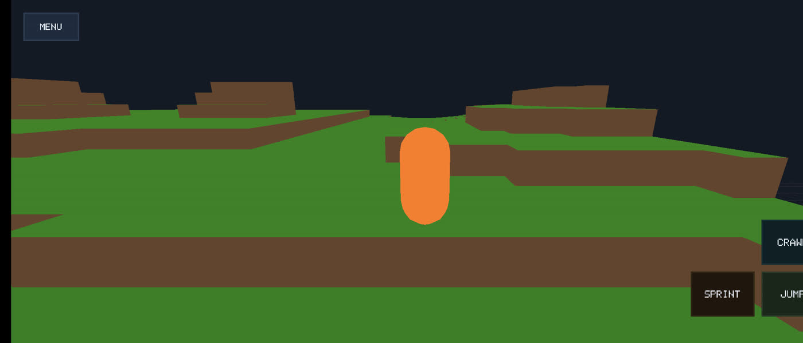
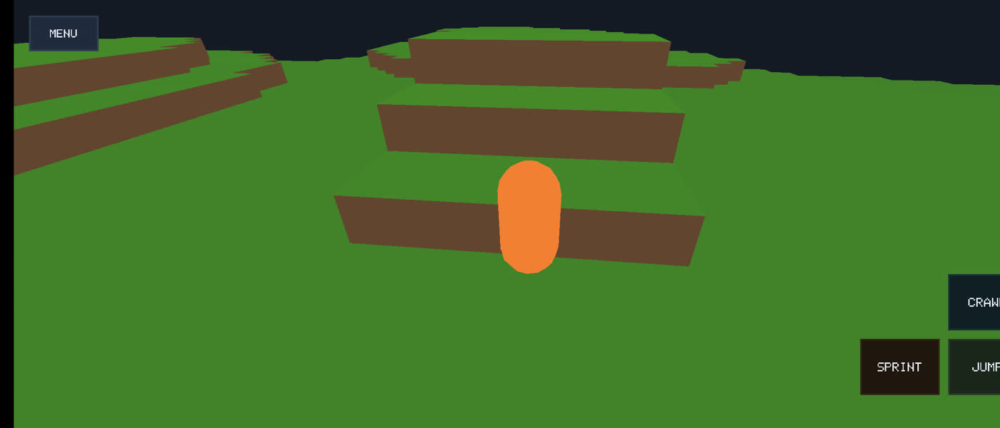

# VOXOV

VOXOV is a C++23 voxel game prototype with multiplayer, physics, and multiple runtime targets built from one repository.

The current project shape is:

- Desktop is the primary shared-engine runtime.
- Android is a separate native runtime that reuses gameplay and data code but does not yet share the full desktop engine loop.
- Web is an experimental preview target.

## Install

Release artifacts are published on GitHub Releases:

- https://github.com/kyambuthia/voxov/releases

Published bundles currently include:

- Linux: `VOXOV-<tag>-linux-x86_64.tar.gz`
- Windows: `VOXOV-<tag>-windows-x86_64.zip`
- Android: `VOXOV-<tag>-android-arm64-v8a.apk`

## Build From Source

Clone with submodules:

```bash
git clone --recurse-submodules github.com/kyambuthia/voxov.git
cd voxov
```

Desktop build:

```bash
cmake -S . -B build/desktop/main -DVOXOV_BUILD_TESTS=ON
cmake --build build/desktop/main --parallel
```

Run:

```bash
./build/desktop/main/bin/voxov
```

Tests:

```bash
ctest --test-dir build/desktop/main --output-on-failure
```

## Architecture Snapshot

- `src/game/main.cpp` is the main desktop entry point.
- `src/engine/*` owns the desktop runtime loop, rendering, physics, networking, UI, and gameplay orchestration.
- `src/game/android_main.cpp` and `src/game/web_main.cpp` are separate platform-specific runtime paths.
- Core third-party dependencies are GLFW, ENet, Jolt Physics, Dear ImGui, GLM, fmt, and spdlog.

The codebase is designed reasonably well for a fast-moving prototype: the desktop renderer is now aligned to an OpenGL-first, GLES3/WebGL2-class target, the build graph is split into engine modules, and CI validates packaged artifacts. The main design debt is architectural drift between the desktop runtime and the Android/Web runtimes, plus a large `Engine` orchestration layer that owns too many responsibilities.

The current refactor target is a shared `GameRuntime` layer with thin platform adapters so
desktop, Android, and Web converge on one runtime contract instead of maintaining parallel
orchestration paths.

## Docs

- Setup: `docs/SETUP.md`
- Running and testing: `docs/RUNNING.md`
- Active targets: `docs/ACTIVE_TARGETS.md`
- Architecture: `docs/ARCHITECTURE.md`
- Roadmap: `docs/ROADMAP.md`
- Networking: `docs/NETWORKING.md`
- Android: `docs/ANDROID.md`
- Web: `docs/WEB.md`
- Releases: `docs/RELEASES.md`

## Assets

- UI sounds live under `assets/audio/ui/`.
- Audio provenance and licensing are documented in `assets/audio/ui/README.md`.

## Showcase

### Current Android Gameplay


| Android Screenshot 1 | Android Screenshot 2 |
| --- | --- |
|  |  |

### Previous Showcase


| Screenshot 1 | Screenshot 2 |
| --- | --- |
|  |  |
