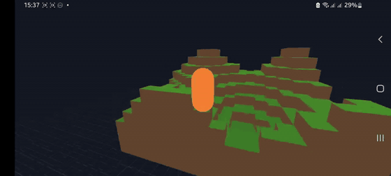
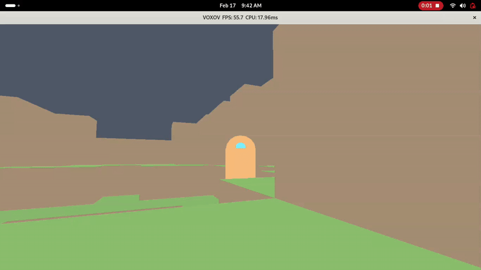
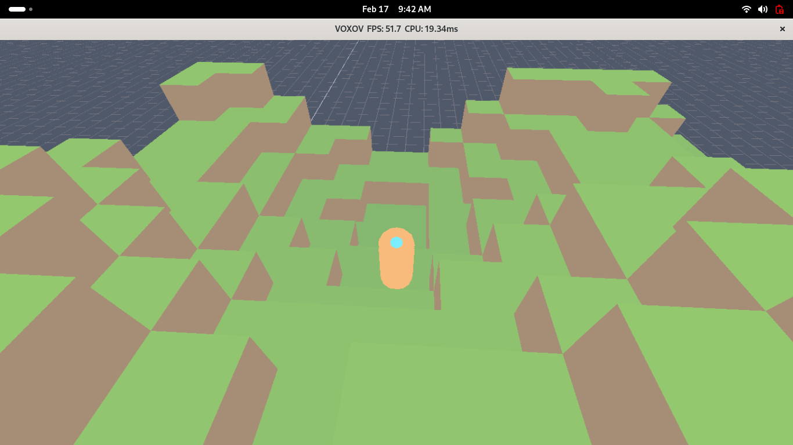
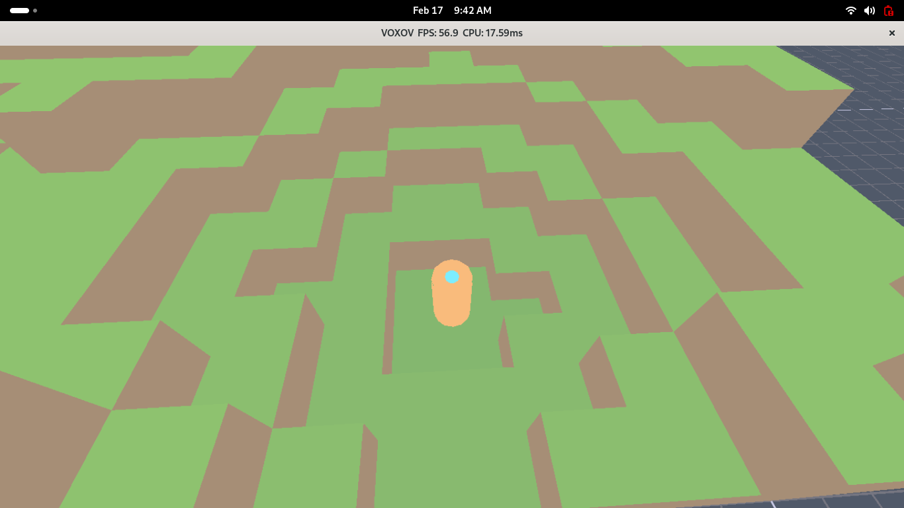

## Install (Start Here)

### Windows
## 👉👉👉 Download here: https://github.com/kyambuthia/voxov/releases/tag/0.0.20
- In the release assets, download: `VOXOV-0.0.20-windows-x86_64.zip`
- Extract the ZIP.
- Run `voxov.exe`.

### Android
## 👉👉👉 Download here: https://github.com/kyambuthia/voxov/releases/tag/0.0.20
- In the release assets, download: `VOXOV-0.0.20-android-arm64-v8a.apk`
- Open the APK on your phone and allow install from unknown sources if prompted.
- Launch `VOXOV`.

### Linux
## 👉👉👉 Download here: https://github.com/kyambuthia/voxov/releases/tag/0.0.20
- In the release assets, download: `VOXOV-0.0.20-linux-x86_64`
- Run:

```bash
chmod +x VOXOV-0.0.20-linux-x86_64
./VOXOV-0.0.20-linux-x86_64
```

## About VOXOV
VOXOV is a cross-platform multiplayer co-op voxel game in development.
It targets desktop, mobile, and console-class platforms from one shared codebase.

## Setup From Source
- Clone with submodules:

```bash
git clone --recurse-submodules github.com/kyambuthia/voxov.git
cd voxov
```

- Build (desktop):

```bash
mkdir build && cd build
cmake .. && cmake --build .
```

- Android setup/build details: `docs/ANDROID.md`
- Web setup/build details: `docs/WEB.md`
- Full setup guide: `docs/SETUP.md`

## Docs
- Docs overview and setup: `docs/SETUP.md`
- Run and test: `docs/RUNNING.md`
- Android: `docs/ANDROID.md`
- Web: `docs/WEB.md`
- Build/release details: `docs/RELEASES.md`
- Full docs folder: `docs/`

## Showcase




| Screenshot 1 | Screenshot 2 |
| --- | --- |
|  |  |
