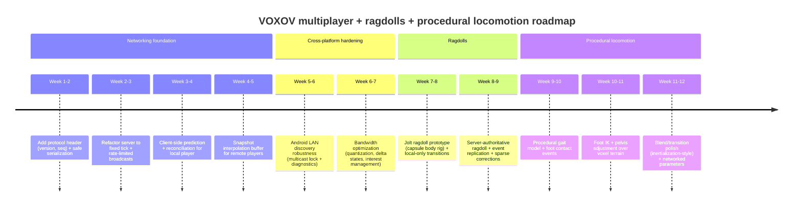

# VOXOV Handbook

This handbook consolidates the current repository documentation into one place for easier access. The sections below preserve the existing files verbatim, grouped in a stable reading order.

## Contents

- `README.md`
- `docs/SETUP.md`
- `docs/RUNNING.md`
- `docs/BUILD_PLATFORMS.md`
- `docs/ACTIVE_TARGETS.md`
- `docs/ARCHITECTURE.md`
- `docs/NETWORKING.md`
- `docs/WEB.md`
- `docs/ANDROID.md`
- `docs/DEBUGGING.md`
- `docs/EXTENDING.md`
- `docs/ROADMAP.md`
- `docs/ENGINE_VISION.md`
- `docs/RELEASES.md`
- `docs/AVBD_INTEGRATION.md`
- `docs/GENESIS_REFACTOR_PLAN.md`
- `docs/VOXEL_WORLD_DESIGN.md`
- `docs/VOXOV_IMPLEMENTATION_GUIDE.md`
- `docs/player_controller.md`
- `docs/voxov.md`

---

## Source: `README.md`

# VOXOV

VOXOV is a C++23 voxel game prototype with multiplayer, physics, and multiple runtime targets built from one repository.

The current project shape is:

- Desktop is the primary runtime and now boots through a shared `GameRuntime` seam.
- Android is a separate native runtime that reuses gameplay, networking, and data code but does not yet run through `GameRuntime`.
- Web is an experimental preview target that currently shares menu/session helpers rather than the full desktop runtime.
- A standalone authoritative server binary ships as `voxov_server`.

## Install

Release artifacts are published on GitHub Releases:

- https://github.com/kyambuthia/voxov/releases

Published bundles currently include:

- Linux: `VOXOV-<tag>-linux-x86_64.tar.gz`
- Windows: `VOXOV-<tag>-windows-x86_64.zip`
- Android: `VOXOV-<tag>-android-arm64-v8a.apk`

## Build From Source

Clone with submodules:

```bash
git clone --recurse-submodules github.com/kyambuthia/voxov.git
cd voxov
```

Desktop build:

```bash
cmake -S . -B build/desktop/main -DVOXOV_BUILD_TESTS=ON
cmake --build build/desktop/main --parallel
```

Run:

```bash
./build/desktop/main/bin/voxov
```

Dedicated server:

```bash
./build/desktop/main/bin/voxov_server --port 7777
./build/desktop/main/bin/voxov_server --port 7777 --telemetry-json
```

Tests:

```bash
ctest --test-dir build/desktop/main --output-on-failure
```

## Architecture Snapshot

- `src/game/main.cpp` is the desktop entry point and boots the game through `GameRuntime` plus desktop input/platform adapters.
- `src/game/server_main.cpp` is the standalone dedicated server entry point.
- `src/game/game_runtime.cpp` is the runtime-facing shell currently wrapping the transitional desktop `Engine`.
- `src/engine/*` still owns most desktop simulation, rendering, networking, UI, and gameplay orchestration while the runtime extraction continues.
- Networking is now split into protocol (`src/engine_net_proto/*`), ENet transport (`src/engine_net/*`), LAN discovery, and server-session layers.
- `src/game/android_main.cpp` and `src/game/web_main.cpp` remain separate platform-specific runtime paths.
- Core third-party dependencies are GLFW, ENet, Jolt Physics, Dear ImGui, GLM, fmt, and spdlog.

The codebase is designed reasonably well for a fast-moving prototype: the desktop renderer is now aligned to an OpenGL-first, GLES3/WebGL2-class target, the build graph is split into engine modules, the dedicated server is separated into its own binary, and CI validates packaged artifacts. The main design debt is still architectural drift between the desktop runtime and the Android/Web runtimes, plus a large `Engine` orchestration layer that owns too many responsibilities behind the new runtime seam.

The current refactor direction is to deepen the `GameRuntime` contract, continue shrinking `Engine`, and migrate Android/Web toward the same runtime interfaces instead of maintaining parallel orchestration paths.

## Docs

- Setup: `docs/SETUP.md`
- Running and testing: `docs/RUNNING.md`
- Active targets: `docs/ACTIVE_TARGETS.md`
- Architecture: `docs/ARCHITECTURE.md`
- Platform support: `docs/BUILD_PLATFORMS.md`
- Roadmap: `docs/ROADMAP.md`
- Networking: `docs/NETWORKING.md`
- Android: `docs/ANDROID.md`
- Web: `docs/WEB.md`
- Releases: `docs/RELEASES.md`

## Assets

- UI sounds live under `assets/audio/ui/`.
- Audio provenance and licensing are documented in `assets/audio/ui/README.md`.

## Showcase

### Current Android Gameplay


| Android Screenshot 1 | Android Screenshot 2 |
| --- | --- |
|  |  |

### Previous Showcase


| Screenshot 1 | Screenshot 2 |
| --- | --- |
|  |  |


---

## Source: `docs/SETUP.md`

# Setup Guide

## 1. Prerequisites

- CMake `>=3.16`
- C++23 compiler (`g++`, `clang++`, or MSVC)
- OpenGL development libraries
- Git with submodule support

Linux (Debian/Ubuntu baseline):

```bash
sudo apt-get update
sudo apt-get install -y \
  build-essential cmake ninja-build \
  libgl1-mesa-dev \
  libwayland-dev libx11-dev libxcursor-dev \
  libxi-dev libxinerama-dev libxkbcommon-dev libxrandr-dev
```

## 2. Clone

```bash
git clone --recurse-submodules https://github.com/kyambuthia/voxov.git
cd voxov
git submodule update --init --recursive
```

## 3. Configure + Build

Default desktop build:

```bash
cmake -S . -B build/desktop/main -DVOXOV_BUILD_TESTS=ON
cmake --build build/desktop/main --parallel
```

Useful configure flags:

- `-DVOXOV_BUILD_TESTS=ON`
- `-DVOXOV_ENABLE_XR=ON` to compile the XR scaffold
- `-DVOXOV_ENABLE_IOS_BACKEND=ON` to compile the iOS scaffold
- `-DVOXOV_ENABLE_CONSOLE_BACKEND=ON` to compile the console scaffold
- `-DVOXOV_BUILD_LEGACY_DEMOS=ON` to expose the legacy SDL/Vulkan sources in the build graph
- `-DUSE_AVX2=OFF -DUSE_F16C=OFF -DUSE_FMADD=OFF -DUSE_LZCNT=OFF` for older CPUs that crash with illegal-instruction.

Notes:

- Android and Web builds are selected by the toolchain (`ANDROID` or `EMSCRIPTEN`), not by a normal desktop configure flag.
- Desktop is the main integrated runtime, boots through `GameRuntime`, and uses an OpenGL-first renderer aligned to a GLES3/WebGL2-class feature budget.
- Android and Web use separate runtime paths today.

## 4. Run

Desktop:

```bash
./build/desktop/main/bin/voxov
```

Dedicated authoritative server:

```bash
./build/desktop/main/bin/voxov_server --port 7777
```

Compatibility headless server mode:

```bash
./build/desktop/main/bin/voxov --headless-server --port 7777
```

## 5. Debug and Visual Debug

General gameplay debug:

```bash
./build/desktop/main/bin/voxov --devhud
./build/desktop/main/bin/voxov --devhud --noclip
```

Collision visual debugging:

```bash
./build/desktop/main/bin/voxov --debug-collision
./build/desktop/main/bin/voxov --debug-xray
./build/desktop/main/bin/voxov --debug-collision-only
./build/desktop/main/bin/voxov --debug-freeze
```

Hotkeys:

- `F1` toggle collision debug draw
- `F2` toggle xray debug draw
- `F3` toggle collision-only debug primitives
- `F4` freeze/unfreeze current debug frame

## 6. Tests

Build tests are only generated if the configure step used `-DVOXOV_BUILD_TESTS=ON`.

```bash
ctest --test-dir build/desktop/main --output-on-failure
```

## 7. Asset Cooker

```bash
./build/desktop/main/bin/voxov_asset_cooker gltf assets/ship.glb build/desktop/main/ship.vasset
./build/desktop/main/bin/voxov_asset_cooker texture assets/albedo.ktx2 build/desktop/main/albedo.vtex
```

## 8. Clean Rebuild

Linux/macOS:

```bash
./scripts/clean_build.sh
```

Windows PowerShell:

```powershell
.\scripts\clean_build.ps1
```

Windows Batch:

```bat
scripts\clean_build.bat
```

## 9. Releases

For release tags and downloadable binaries, see `docs/RELEASES.md`.

## 10. Roadmap

For current architectural priorities and platform sequencing, see `docs/ROADMAP.md`.

## 11. Android

For Android NDK/Android Studio bring-up and build steps, see `docs/ANDROID.md`.


---

## Source: `docs/RUNNING.md`

# Running VOXOV

## Desktop Runtime

Desktop:

```bash
./build/desktop/main/bin/voxov
```

Window mode and size:

```bash
./build/desktop/main/bin/voxov --windowed --width 1600 --height 900
./build/desktop/main/bin/voxov --fullscreen
```

Connect to a server:

```bash
./build/desktop/main/bin/voxov --connect 127.0.0.1 --port 7777 --devhud
```

Host in one process:

```bash
./build/desktop/main/bin/voxov --server
```

Standalone dedicated server:

```bash
./build/desktop/main/bin/voxov_server --port 7777
```

Compatibility headless server mode:

```bash
./build/desktop/main/bin/voxov --headless-server --port 7777
```

## Useful Runtime Flags

- `--physics jolt|avbd`
- `--devhud`
- `--noclip`
- `--splitscreen`
- `--debug-collision`
- `--debug-xray`
- `--debug-collision-only`
- `--debug-freeze`
- `--vehicle-sandbox`
- `--spherical-planet`
- `--flat-world`
- `--fullscreen`
- `--windowed`
- `--width <pixels>`
- `--height <pixels>`
- `--connect <host>`
- `--port <port>`
- `--server`
- `--headless-server`

Notes:

- Desktop now uses the OpenGL renderer by default.
- `--renderer gl` is still accepted as a compatibility alias, but it is no longer required.
- `voxov_server` is the preferred standalone authoritative server target.
- `voxov --headless-server` remains useful for compatibility and quick local bring-up, but it is no longer the only dedicated-server path.
- `voxov_server` now prints rate-limited `TEL ...` telemetry lines (about every 5 seconds) with loop, network, and server activity counters.
- `--telemetry-json` switches those server telemetry lines to compact JSON for automation.

## Desktop Hotkeys

- `F11` toggle fullscreen
- `Esc` release mouse capture
- Right-click recapture mouse look
- `F1` toggle collision debug draw
- `F2` toggle xray debug draw
- `F3` toggle collision-only debug draw
- `F4` freeze/unfreeze current debug frame
- `F5` cycle reconcile mode

## Tests

Build tests first:

```bash
cmake -S . -B build/desktop/main -DVOXOV_BUILD_TESTS=ON
cmake --build build/desktop/main --parallel
```

Run:

```bash
ctest --test-dir build/desktop/main --output-on-failure
```

The network stress test binds loopback ports, so it may fail inside restrictive sandboxes even when the project is healthy.

## Asset Cooker

```bash
./build/desktop/main/bin/voxov_asset_cooker gltf assets/ship.glb build/desktop/main/ship.vasset
./build/desktop/main/bin/voxov_asset_cooker texture assets/albedo.ktx2 build/desktop/main/albedo.vtex
```

## Related Docs

- Setup/build details: `docs/SETUP.md`
- Platform support: `docs/BUILD_PLATFORMS.md`
- Networking details: `docs/NETWORKING.md`
- Release workflow: `docs/RELEASES.md`


---

## Source: `docs/BUILD_PLATFORMS.md`

# Platform Support

This document describes the repository as it exists today, not the long-term target vision.

## Status Matrix

| Platform | Status | Runtime Path | Verification |
| --- | --- | --- | --- |
| Linux desktop | Supported | Shared desktop runtime (`src/game/main.cpp` + `src/game/game_runtime.cpp`) | CI build + tests + release bundle validation |
| Windows desktop | Supported for release packaging | Shared desktop runtime | Release packaging and startup smoke test |
| macOS desktop | Goal / unverified | Intended shared desktop runtime | No active CI coverage in this repo |
| Android | Supported | `src/game/android_main.cpp` | Release APK validation + CI emulator startup smoke |
| Web | Preview | `src/game/web_main.cpp` | CI Emscripten build + artifact smoke check |
| iOS | Scaffold | `src/platform/ios_platform.cpp` | Placeholder only |
| Consoles | Scaffold | `src/platform/console_platform.cpp` | Placeholder only |
| XR | Scaffold | `src/engine_xr/xr_session.cpp` | Placeholder only |

## Desktop

Configure and build:

```bash
cmake -S . -B ./build/desktop/main -DVOXOV_BUILD_TESTS=ON
cmake --build ./build/desktop/main --parallel
```

Run desktop:

```bash
./build/desktop/main/bin/voxov
```

Run local client + server:

```bash
./build/desktop/main/bin/voxov --server
```

Run dedicated server:

```bash
./build/desktop/main/bin/voxov_server --port 7777
```

Notes:

- Desktop is now OpenGL-only and is intended to stay inside a GLES3/WebGL2-class rendering budget.
- `voxov_server` is the preferred standalone authoritative server target.
- `voxov --headless-server` still exists as a compatibility path for quick bring-up from the client executable.
- `ctest` requires a build configured with `-DVOXOV_BUILD_TESTS=ON`.

## Android

Android is not just a stub. It remains a separate runtime path from desktop, but now has CI startup smoke coverage.

- Native target: `voxov_android`
- Entry point: `src/game/android_main.cpp`
- Packaging flow: Gradle app under `android/`

Build via Gradle:

```bash
gradle -p android :app:assembleDebug
```

See `docs/ANDROID.md` for NDK and APK details.

## Web

Web is a preview path used for lightweight runtime bring-up, menu flow, and transport-hook experimentation, with CI build validation.

Configure:

```bash
EM_CACHE=./build/web/cache emcmake cmake -S . -B ./build/web/main -G Ninja
```

Build:

```bash
EM_CACHE=./build/web/cache cmake --build ./build/web/main --parallel
```

Expected outputs:

- `./build/web/main/bin/voxov_web.html`
- `./build/web/main/bin/voxov_web.js`
- `./build/web/main/bin/voxov_web.wasm`

## Platform Selection Notes

- Android and Web targets are selected by the active toolchain (`ANDROID` or `EMSCRIPTEN`), not by desktop build flags alone.
- The repo still contains target-selection and platform-status docs that describe the long-term vision; use this file plus `docs/ACTIVE_TARGETS.md` as the ground truth for current support levels.


---

## Source: `docs/ACTIVE_TARGETS.md`

# VOXOV Active Targets

This repository currently ships these active entrypoints:

- Desktop: `src/game/main.cpp` (`voxov`)
- Dedicated server: `src/game/server_main.cpp` (`voxov_server`)
- Android: `src/game/android_main.cpp` (`voxov_android`)
- Web preview: `src/game/web_main.cpp` (`voxov_web`)

Desktop is the first target booting through the shared `GameRuntime` seam. Android and Web still keep separate runtime loops.

The desktop client also still supports combined local client/server bring-up via `--server` and the older `--headless-server` compatibility mode, but the preferred dedicated-server entrypoint is `voxov_server`.

The repository also contains non-shipping platform scaffolds that are disabled by default:

- iOS backend scaffold: `src/platform/ios_platform.cpp`
- Console backend scaffold: `src/platform/console_platform.cpp`
- XR session scaffold: `src/engine_xr/xr_session.cpp`

The following source files are legacy/demo codepaths and are not built by default:

- `src/main.cpp`
- `src/game.cpp`
- `src/renderer/vulkan_app.cpp`
- `src/world/planet_world.cpp`
- `src/engine_assets/static_model.cpp`

If these legacy paths are revived, move them behind explicit CMake options and keep them isolated from the shipping runtime.


---

## Source: `docs/ARCHITECTURE.md`

# VOXOV Architecture

This document describes the architecture that is implemented today.

## Runtime Matrix

- Desktop: primary integrated runtime in `src/game/main.cpp`, booted through `GameRuntime` and desktop adapters, with `Engine` still providing most implementation
- Dedicated server: `src/game/server_main.cpp`, a standalone authoritative ENet server binary
- Android: separate native runtime in `src/game/android_main.cpp`
- Web: preview runtime in `src/game/web_main.cpp`
- iOS, console, and XR: scaffolds only, disabled by default

The important distinction is that VOXOV is a shared codebase with a real shared runtime seam on desktop, but not yet a single shared runtime architecture across every target.

## Desktop Runtime

The desktop target is the cleanest path in the repository:

1. `src/game/main.cpp` parses CLI flags, optionally starts an in-process `NetServer`, and creates `DesktopPlatform`
2. `DesktopRuntimePlatformAdapter` and `DesktopRuntimeInputAdapter` bridge platform services into `GameRuntime`
3. `GameRuntime` owns per-frame platform polling, menu/session flow orchestration, and the runtime-facing shell API
4. `Engine` still owns most fixed-step simulation, renderer, physics, networking, and presentation assembly behind that shell
5. `Renderer` currently targets a single OpenGL desktop backend and keeps the render contract aligned with GLES3/WebGL2-class limits

Core module boundaries:

- `engine_core/*`: timing and low-level helpers
- `engine_math/*`: camera and transforms
- `engine_render/*`: render abstractions plus the active OpenGL backend
- `engine_world/*`: voxel terrain and collision helpers
- `engine_physics/*`: physics backends and vehicle helpers
- `engine_net_proto/*`: protocol types, headers, feature flags, and POD helpers
- `engine_net/*`: ENet client/server transport plus networking runtime helpers
- `engine_server/*`: authoritative server session/state
- `engine_ui/*`: in-game menu flow
- `engine_runtime/*`: shared runtime state and session helpers
- `engine_presentation/*`: HUD/debug snapshot building
- `engine_gameplay/*`: player, animation, minigames, and related gameplay code
- `game/*`: entry points, runtime adapters, and `GameRuntime`

## Target-Specific Paths

### Android

Android shares lower-level modules such as world, gameplay, networking, session helpers, and UI code, but it does not yet reuse the desktop `GameRuntime` path. The Android target still runs its own native loop, rendering path, and platform integration.

### Web

The Web target is a lightweight preview. It currently reuses the session/menu controller but still implements its own minimal movement loop and JavaScript transport hooks rather than the full desktop runtime. The intended direction is to move more gameplay and runtime code into WASM while keeping JavaScript limited to browser I/O, asset/bootstrap wiring, and browser-appropriate transport glue.

### Legacy and Future Scaffolds

The repository still contains:

- legacy SDL/Vulkan demo sources under `src/main.cpp`, `src/game.cpp`, `src/renderer/*`, and `src/world/*`
- future scaffolds for iOS, console, and XR

These paths are useful reference material, but they are not the main shipping runtime.

## What Is Designed Well

- The repository already has sensible module folders under `src/engine_*`
- The desktop runtime keeps rendering behind a backend abstraction even after converging on one backend
- Build outputs, tests, and release packaging are clearly represented in CMake and GitHub Actions
- Platform ambition is documented separately from the code, rather than being hidden in random source files

## Current Design Liabilities

### 1. `Engine` is still too broad

`Engine` still owns rendering, physics, local and remote player state, networking, UI, persistence, objectives, minigames, vehicle state, and split-screen flow. Wrapping it behind `GameRuntime` improves entry-point shape, but it does not yet make those responsibilities modular.

### 2. The shared runtime seam is still shallow

Desktop now uses `GameRuntime`, and session-flow orchestration plus FPS rollup ownership now live in `game/*`. Most runtime behavior still drops directly into `Engine`, so the next refactor steps should keep moving real state ownership into `game/*`, `engine_runtime/*`, and `engine_presentation/*` rather than stopping at an adapter wrapper.

### 3. Cross-platform behavior is only partially shared

Android and Web still bypass the desktop `GameRuntime` path. That means gameplay, networking, and menu behavior can drift across targets even when they nominally ship from one repository.

## Shared Runtime Contract

The shared runtime contract now exists and looks like this:

1. `GameRuntime` exposes initialization, input handoff, per-frame ticking, shutdown, and connect entrypoints.
2. Platform entry points stay thin and own only lifecycle, native window/context setup, platform event pumping, and platform-specific input capture.
3. Desktop is already on that path; Android and Web are the next migrations.

Current ownership split:

- `src/game/*`: thin entry points plus `GameRuntime` and platform adapter interfaces
- `src/engine_runtime/*`: shared runtime state and session helpers
- `src/engine/*`: transitional desktop orchestrator that will shrink as runtime state moves into the shared layer
- `src/platform/*`: desktop/native platform adapters and services only

## Planned Subsystem Boundaries

The refactor target remains a small set of explicit subsystems instead of one large `Engine` orchestrator.

### Runtime orchestration

Shared runtime code should own:

- fixed-step progression
- session/menu state transitions
- input distribution to simulation
- coordination between gameplay, networking, persistence, and presentation

### Gameplay domain

Gameplay code should own:

- local player simulation
- vehicles and aircraft
- minigames and objective interactions
- gameplay-facing state transitions that do not depend on platform APIs

### Networking domain

Networking is now split into separate layers and should stay that way:

- `engine_net_proto`: wire types, serializers, validators, and protocol flags only
- `engine_net_transport`: ENet transport only
- `engine_net_discovery`: LAN discovery only
- client runtime
- `engine_server`: server simulation/state

Protocol code must not depend on world generation, renderer types, or platform APIs.

### Presentation domain

Presentation should consume abstract scene and HUD/debug snapshots rather than owning
simulation state directly. Gameplay and runtime code may build render-facing data, but
shared runtime code must not depend on platform-specific renderer implementations.

## Planned Build Graph

The build graph is already moving toward a layered shape so shared code compiles once and is reused by every runtime.

1. foundation: `engine_core`, `engine_math`
2. domain: `engine_world`, `engine_physics`, `engine_server`, `engine_net`
3. gameplay/assets: `engine_gameplay`, `engine_assets`, `engine_audio`, `engine_ui`
4. orchestration: `engine_runtime`, `engine_presentation`
5. platform/apps: renderer backends, runtime entrypoints, and platform adapters

Key rules:

- shared targets must not depend on GLFW, EGL, Emscripten, or other platform headers
- platform executables link the platform adapter and renderer backend they need
- tests link shared libraries only; they should not compile Android or Web platform code

## Refactor Comment Policy

The refactor should add comments only where the control flow or invariants are not
obvious from the code. In practice that means:

- fixed-step advancement and accumulator behavior
- prediction/reconciliation ordering and buffer assumptions
- protocol and wire-format invariants
- JNI, EGL, or browser lifecycle constraints
- cached platform metadata or cross-platform state synchronization assumptions

Do not add explanatory comments for straightforward data movement or simple setter/getter
logic.

## Execution Priorities

1. Keep the runtime and adapter interfaces stable while moving real ownership behind them.
2. Move more session/world/presentation state out of `Engine` and into shared runtime-facing modules.
3. Keep networking cleanly split across protocol, transport, discovery, client, and server-session layers.
4. Remove platform-only dependencies from shared render/runtime code.
5. Migrate Android and Web to thin adapters over the shared runtime.
6. Remove duplicate runtime paths after parity is established.

For execution priorities, see `docs/ROADMAP.md`.


---

## Source: `docs/NETWORKING.md`

# Networking Guide

## Overview

VOXOV currently uses an authoritative server model over ENet, with the networking code split into distinct layers:

- `engine_net_proto`: packet headers, protocol versioning, feature/session flags, and POD wire structs
- `engine_net_transport`: ENet client/server transport (`NetClient`, `NetServer`)
- `engine_net_discovery`: LAN discovery
- `engine_server`: authoritative server session/state
- `engine_net`: umbrella target that links discovery + transport for callers

At runtime:

- Server owns world/network truth.
- Clients send input ticks.
- Server sends player snapshots/states and chunk interest responses.
- Transport uses reliable and unreliable channels.

## Runtime Modes

- Standalone dedicated server:
  - `./build/desktop/main/bin/voxov_server --port 7777`
- Combined client + server in one process:
  - `./build/desktop/main/bin/voxov --server`
- Compatibility headless server mode inside the desktop client:
  - `./build/desktop/main/bin/voxov --headless-server --port 7777`
- Client connect:
  - `./build/desktop/main/bin/voxov --connect <SERVER_IP> --port 7777`

## LAN Bring-up (2-3 machines)

Server machine:

```bash
./build/desktop/main/bin/voxov_server --port 7777
```

Client machine A:

```bash
./build/desktop/main/bin/voxov --connect <SERVER_LAN_IP> --port 7777 --devhud
```

Client machine B:

```bash
./build/desktop/main/bin/voxov --connect <SERVER_LAN_IP> --port 7777 --devhud
```

## Validation Checklist

- Client logs contain `Assigned network player id=...`.
- `--devhud` `REM` count is `>= 1` when peers are connected.
- Movement from one client updates remote capsules on other clients.
- Server process remains running and does not report bind/init failures.

## Packet Types (Current)

- `Input`: client input tick to server.
- `Snapshot`: server authoritative local-player snapshot to client.
- `AssignPlayer`: server-assigned network id.
- `PlayerState`: replicated player state broadcast.
- `PlayerRemove`: player removal broadcast.
- `ChunkInterest`: client chunk-interest request.
- `ChunkState`: server chunk-state response.
- `ProtocolInfo`: protocol/version/feature handshake data.
- `SessionInfo`: server/session metadata.

See:

- `src/engine_net_proto/net_types.hpp`
- `src/engine_net_proto/net_protocol_helpers.hpp`
- `src/engine_net/net_client.cpp`
- `src/engine_net/net_server.cpp`
- `src/engine_net/lan_discovery.cpp`
- `src/engine_server/server_session.cpp`

## Troubleshooting

- Cannot connect:
  - verify server IP and port
  - verify firewall allows UDP traffic on server port
  - confirm server started without ENet init/listen errors
- Connects but no remote movement:
  - run both clients with `--devhud`
  - check assignment logs and `REM` value
  - ensure both clients are connected to same server endpoint
- High jitter:
  - keep `--devhud` enabled and inspect `dt`, `fixed_dt`, and remote count
  - compare frame time, render time, and fixed-step spikes across machines

## Notes

- Current networking is still foundation-level and still WIP.
- Protocol framing, versioning, packet headers, and feature/session metadata are now explicit in `engine_net_proto`.
- The recent refactor direction is to keep protocol, transport, discovery, and server-session responsibilities separated while Android/Web move toward the same runtime model.


---

## Source: `docs/WEB.md`

# Web Build (Emscripten)

## Status

Web support is an active preview target with:

- a playable local movement loop
- menu/devhud flow parity with desktop controls
- shared Web session-flow orchestration (`WebSessionFlow`) for host/join/leave state
- WebGL2 runtime bring-up
- optional JS transport hooks for host/join state exchange

The current preview is still JS-heavy. `src/game/web_main.cpp` still owns the movement loop and browser hook integration, while the Emscripten build compiles a focused subset of shared runtime helpers (`RuntimeSessionController`, `GuiMenu`, and `WebSessionFlow`). The next step is not "more JavaScript"; it is more shared C++ compiled to WASM.

## Prerequisites

1. Emscripten SDK installed and activated.
2. CMake and Ninja available.

## Configure

From repository root:

```bash
EM_CACHE=./build/web/cache emcmake cmake -S . -B build/web/main -G Ninja
```

## Build

```bash
EM_CACHE=./build/web/cache cmake --build build/web/main --parallel
```

Expected output:

- `build/web/main/bin/voxov_web.js`
- `build/web/main/bin/voxov_web.wasm`
- `build/web/main/bin/voxov_web.html`

## Run locally

Option 1:

```bash
emrun --no_browser --port 8080 build/web/main/bin/voxov_web.html
```

Option 2:

```bash
python3 -m http.server 8080 --directory build/web/main/bin
```

Then open:

- `http://localhost:8080/voxov_web.html`

## Notes

1. Attach optional transport hooks in JS:
   - `Module.__voxovNetHost()`
   - `Module.__voxovNetJoin()`
   - `Module.__voxovNetSendLocal(x,y,z,yaw)`
   - `Module.__voxovNetRemoteCount()`
2. Full gameplay/runtime parity with the desktop OpenGL-first runtime remains future work.

## WASM Integration Direction

The right integration direction for Web is:

1. Compile more shared code into WASM first.
   - Move the Web target toward `GameRuntime`, `engine_runtime`, `engine_gameplay`, `engine_world`, `engine_math`, and `engine_net_proto` instead of keeping equivalent logic in `web_main.cpp`.
   - Keep browser-specific concerns out of those libraries.
2. Keep JavaScript as a thin browser adapter.
   - JavaScript should own DOM bootstrapping, canvas setup, input event collection, persistence hooks, and browser-safe networking integration.
   - JavaScript should not own gameplay state, menu rules, movement simulation, or protocol definitions.
3. Introduce Web-specific runtime adapters instead of a separate runtime.
   - Mirror the desktop shape with `IRuntimePlatformAdapter` and `IRuntimeInputAdapter` implementations for Emscripten/browser input.
   - Feed browser events into `GameRuntime` rather than reimplementing session flow in the Web entrypoint.
4. Keep transport browser-appropriate.
   - Do not try to force ENet directly into the browser runtime model.
   - Keep `engine_net_proto` in WASM and expose a thin transport shim for WebRTC, WebTransport, or a WebSocket bridge.
   - That preserves one protocol definition across desktop, server, Android, and Web even if transport implementations differ.
5. Preserve the rendering budget.
   - Continue treating WebGL2 and GLES3-class limits as the content/rendering ceiling.
   - Prefer shared render-facing snapshots and scene assembly in C++, with only the unavoidable WebGL/browser bootstrap remaining platform-specific.

## Practical Next Steps

1. Add a Web runtime adapter pair and reuse `GameRuntime` from the Emscripten build.
2. Move menu/session control entirely into shared runtime code on Web.
3. Move local movement and simulation state out of `web_main.cpp` and into shared gameplay/runtime modules.
4. Keep the current JS hooks, but reduce them to transport and browser I/O only.
5. Once that is stable, replace ad-hoc local/remote browser state with protocol-driven state built from shared `engine_net_proto` types.


---

## Source: `docs/ANDROID.md`

# Android Build Guide

## Current status

Android is an active gameplay target, not just bring-up.

- Runtime entrypoint: `src/game/android_main.cpp`
- Native target: `voxov_android` (`libvoxov.so`)
- Rendering path: EGL + OpenGL ES runtime in native loop
- Multiplayer path: ENet client/server integration, remote interpolation, dev HUD net stats
- LAN discovery: multicast permission + native-side `WifiManager.MulticastLock` management during host/join discovery

## Prerequisites

- Android Studio installed
- Android SDK + NDK installed
- Java 21 (for Gradle release workflow parity)
- `ANDROID_NDK_HOME` set when doing direct native CMake builds

## Build via Gradle (recommended)

From repo root:

```bash
gradle -p android :app:assembleDebug
```

Release APK (signed via configured keystore vars):

```bash
gradle -p android :app:assembleRelease
```

Expected artifacts:

- Debug: `android/app/build/outputs/apk/debug/app-debug.apk`
- Release: `android/app/build/outputs/apk/release/app-release.apk`

## Build native library via CMake (arm64)

```bash
cmake -S . -B ./build/android/arm64-cmake \
  -G Ninja \
  -DCMAKE_TOOLCHAIN_FILE="$ANDROID_NDK_HOME/build/cmake/android.toolchain.cmake" \
  -DANDROID_ABI=arm64-v8a \
  -DANDROID_PLATFORM=29 \
  -DCMAKE_BUILD_TYPE=Debug

cmake --build ./build/android/arm64-cmake --parallel
```

Expected native output:

- `./build/android/arm64-cmake/lib/libvoxov.so` (or equivalent toolchain output path)

## Runtime validation checklist

After install/launch, check Logcat (`VOXOV` tag):

- `android_main started`
- `APP_CMD_INIT_WINDOW`
- `EGL ready`
- periodic frame/network lines including `rem=`, `cpps=`, `snap=`

Multiplayer checks:

1. Host LAN on one device and join nearby from another.
2. Confirm remote players are visible and animated.
3. Confirm leaving/joining updates remote count and no stale remotes remain.

## Notes

- Android currently uses a native GLES runtime path and does not yet share the full desktop `Engine` orchestration layer.
- Ongoing work should prioritize shared multiplayer/simulation helpers over renderer rewrites.


---

## Source: `docs/DEBUGGING.md`

# Debugging Guide

## Controls (Desktop)

- Mouse controls third-person camera orbit (GTA-style while focused)
- `W/A/S/D` move
- `Space` jump
- `Shift` sprint
- `Q/E` camera distance
- `Esc` GUI menu (W/S or arrows + Enter)

## Runtime Debug Flags

General gameplay debug:

```bash
./build/desktop/main/bin/voxov --devhud
./build/desktop/main/bin/voxov --devhud --noclip
./build/desktop/main/bin/voxov --splitscreen
```

Collision visualization:

```bash
./build/desktop/main/bin/voxov --debug-collision
./build/desktop/main/bin/voxov --debug-xray
./build/desktop/main/bin/voxov --debug-collision-only
./build/desktop/main/bin/voxov --debug-freeze
```

## Debug Hotkeys

- `F1` toggle collision debug draw
- `F2` toggle xray mode (depth-disabled debug draw)
- `F3` toggle collision-only debug primitives
- `F4` freeze/unfreeze current debug frame

## Dear ImGui

- Dear ImGui is integrated in the shared desktop renderer.
- The desktop `VOXOV Debug` panel shows runtime metrics and debug hotkey reminders.


---

## Source: `docs/EXTENDING.md`

# Extending VOXOV

## Add a renderer feature

1. Add shared data in `src/engine_render/render_types.hpp`.
2. Update `IRenderBackend` in `src/engine_render/render_backend.hpp` only if the feature needs backend API changes.
3. Implement in the desktop GL backend (`src/engine_render/gl_renderer.cpp`).
4. Keep the feature inside the GLES3/WebGL2-class capability budget used by the project.
5. Validate in the desktop runtime, then check Android/Web paths if the feature affects shared render contracts.

## Add a replicated component

1. Define wire types and packet headers in `src/engine_net_proto/net_types.hpp`.
2. Add helper builders or validators in `src/engine_net_proto/net_protocol_helpers.hpp` if the message needs shared protocol logic.
3. Add transport handling in `src/engine_net/net_server.cpp` and `src/engine_net/net_client.cpp`.
4. Keep server-side session/state ownership in `src/engine_server/server_session.*` or runtime code instead of pushing policy into protocol headers.
5. Pick channel:
   - reliable: `NetChannel::Reliable`
   - transient/unreliable: `NetChannel::Unreliable`
6. Add or extend serialization tests in `src/tests/test_main.cpp`.

## Add a new asset type

1. Add input/cooked metadata format in `src/tools/asset_cooker.cpp`.
2. Add runtime loader and registry entry (next module target: `engine_assets`).
3. Extend docs with source -> cooked workflow and expected runtime payload.

Current cooker modes:
- `voxov_asset_cooker gltf <input> <output>`
- `voxov_asset_cooker texture <input> <output>`


---

## Source: `docs/ROADMAP.md`

# Roadmap

This roadmap is based on the current repository shape. The main priority is to converge runtimes and reduce architectural drag before adding more platform surface area.

## Near Term

### 1. Deepen The Shared Runtime Core

- Move more desktop ownership out of `Engine` and behind `GameRuntime`:
  - session/game state
  - rendering scene assembly
  - multiplayer/session management
  - debug and tooling overlays
- Introduce platform services for:
  - save paths
  - asset roots
  - environment/runtime discovery
- Stop adding new feature ownership to the monolithic `Engine` where a focused subsystem would work.

### 2. Lock The Renderer To A Mobile-Friendly Budget

- Keep the shipping desktop renderer on an OpenGL-first path instead of rebuilding multi-backend scope.
- Treat GLES3/WebGL2-class constraints as the visual feature ceiling for shared content decisions.
- Spend freed-up engine time on frame pacing, streaming, tooling, and world quality instead of renderer diversification.

### 3. Add Basic Perf Telemetry First

- Add lightweight runtime perf telemetry before expanding other debug overlays.
- Start with:
  - frame time
  - fixed-step time
  - render CPU time
- network send/receive rates
- chunk streaming counters
- Progress: desktop now exposes runtime-owned FPS plus frame/fixed/render/network/chunk counters; Android dev HUD and `voxov_server` now emit compact telemetry rollups for frame/fixed/network/chunk activity where applicable.
- Next: keep the first pass cheap, always available in dev builds, and extend parity to the remaining preview/runtime targets.

### 4. Build Out The Visual Debug Stack

- After basic perf telemetry, add the rest of the gameplay/system visual debug tooling:
  - AI behavior debug
  - navigation and pathfinding debug
  - cover and combat debug
- adversary-state debug
- world-event and point-of-interest debug
- Keep these tools behind clear debug toggles and drive them from shared runtime services rather than platform-specific one-offs.

### 5. Reduce Platform Divergence

- Move Android toward shared simulation/session helpers instead of growing more custom runtime code.
- Move Web toward a WASM-heavy runtime where gameplay, menu/session flow, and simulation live in C++ and JavaScript is reduced to browser APIs, bootstrap, and transport glue.
- Keep iOS, console, and XR work in scaffold mode until desktop, Android, and Web are closer to one runtime model.

### 6. Harden The Dedicated Server Target

- Keep `voxov_server` independent from render and window-system requirements.
- Reduce reliance on the older `voxov --headless-server` compatibility path.
- Expand verification and deployment around the standalone server binary.

### 7. Tighten Verification

- Add clearer support labels everywhere: `supported`, `preview`, `scaffold`.
- Add macOS verification if it is intended to remain an active target.
- Add Web CI coverage.
- Add an Android runtime smoke test on emulator or device farm infrastructure.

## Mid Term

### 8. Asset And Content Pipeline Hardening

- Replace ad-hoc runtime asset probing with explicit asset mount/configuration rules.
- Expand the asset cooker so runtime paths are less dependent on repo-relative layout.
- Make packaged and development builds resolve content the same way.

### 9. Multiplayer And World Streaming

- Expand chunk streaming beyond the current flat-world baseline.
- Harden reconciliation and remote interpolation tooling.
- Separate replication concerns from gameplay-specific controller logic where possible.

## Later

### 10. Reintroduce Deferred Gameplay Systems

- Bring vehicle and aircraft play back as first-class modes after runtime convergence.
- Pair traversal expansion with world streaming and LOD work rather than shipping them as isolated features.

### 11. Future Platforms

- Revisit XR, iOS, and console targets only after:
  - shared runtime services are in place
  - the standalone dedicated server path is stable
  - asset/save path abstractions are real
- Android/Web divergence is materially reduced


---

## Source: `docs/ENGINE_VISION.md`

# VOXOV Engine Vision

VOXOV is evolving from a learning project into a production-oriented rendering/game engine.
The short-term target is a tiny, playable multiplayer demo. The long-term target is an engine
capable of rendering beautiful games (including classic-style aesthetics) with strong multiplayer
and co-op support.

## Product Goals

- **Visual quality**: clean lighting, strong material response, and stable frame pacing.
- **Playable**: input latency, camera control, and interaction feel good.
- **Traversal**: players can walk, drive cars, and fly aircraft on-planet and between planets.
- **Multiplayer**: authoritative server, client prediction, snapshot interpolation.
- **Data-driven**: assets and world data are externalized and reloadable.
- **Tools**: debugging, profiling, and validation are first-class.
- **True cross-platform**: one shared architecture targeting desktop, mobile (Android/iOS), and consoles.

## Non-Goals (For Now)

- Massive open worlds or MMO-scale networking.
- Full editor suite (focus on runtime first).

## Near-Term Milestone: Tiny Multiplayer Demo

The demo should be a small co-op scene that demonstrates:
- client/server connection
- replicated player movement
- a small shared world state (e.g., a few blocks/entities)
- stable frame pacing and render loop
- on-foot traversal baseline first; vehicle/aircraft traversal is intentionally deferred until protocol/runtime hardening is complete

Success criteria: two clients connect to a server, move around, and see each other consistently,
with graceful disconnects and recoveries.

## Architecture Priorities

The near-term demo depends on architecture convergence more than on new target count.
Implementation should follow these priorities:

1. deepen the shared `GameRuntime` contract already used by desktop and migrate Android/Web onto it
2. keep platform entry points thin and limited to lifecycle, native I/O, and renderer hookup
3. split networking into protocol, transport, discovery, client, and server-simulation layers
4. keep shared libraries free of platform headers and platform-only renderer dependencies
5. document only correctness-critical invariants such as fixed-step ordering and
   prediction/reconciliation behavior


---

## Source: `docs/RELEASES.md`

# Releases

## Overview

VOXOV releases are automated with GitHub Actions when pushing a semantic version tag.

Supported tags:

- `0.0.1`
- `v0.0.1`

Workflow file:

- `.github/workflows/release.yml`

## Published artifacts

- `VOXOV-<tag>-linux-x86_64.tar.gz`
- `VOXOV-<tag>-windows-x86_64.zip`
- `VOXOV-<tag>-android-arm64-v8a.apk`

The Linux and Windows assets are runnable bundles (not bare binaries) and include runtime files needed at startup.

## Runtime validation policy

Release workflow validates startup from packaged artifact form before publishing.

Linux bundle checks include:

- executable + launcher script present
- required runtime files present
- unresolved `ldd` dependencies rejected
- startup smoke test (`xvfb-run ...`) must not hard-fail

Windows bundle checks include:

- `voxov.exe` present
- required runtime DLLs present
- process startup smoke test from extracted bundle

Android release checks include:

- release APK created
- APK contains `lib/arm64-v8a/libvoxov.so`

## Release title

Published title format:

- `VOXOV <tag> (Linux/Windows/Android)`

GitHub still auto-adds source archives (`Source code (zip/tar.gz)`) separately.

## Create and push a release tag

```bash
git tag 0.0.1
git push origin 0.0.1
```

Or:

```bash
git tag v0.0.1
git push origin v0.0.1
```

## Notes

- Release builds disable aggressive Jolt SIMD flags for broader CPU compatibility:
  - `USE_AVX2=OFF`
  - `USE_F16C=OFF`
  - `USE_FMADD=OFF`
  - `USE_LZCNT=OFF`
- Linux and Windows release bundles now use the same OpenGL-first desktop runtime.


---

## Source: `docs/AVBD_INTEGRATION.md`

# AVBD Integration Plan (VOXOV)

## Summary

This document evaluates adopting **Augmented Vertex Block Descent (AVBD)** for VOXOV physics, with emphasis on mobile viability and cross-platform delivery.

References:
- Project page: https://graphics.cs.utah.edu/research/projects/avbd/
- Demo source (2D reference): https://github.com/savant117/avbd-demo2d

## What AVBD Gives Us

From the published project description, AVBD extends Vertex Block Descent with an augmented Lagrangian formulation to improve:

1. Handling of hard constraints without instability.
2. Convergence under high stiffness ratios.
3. Contact-heavy scenarios (stacking, friction, articulated constraints).
4. Parallel performance with GPU-oriented implementations.

## Can We Implement It In VOXOV?

Yes, but not as a quick drop-in replacement.

Practical expectation:

1. We can integrate AVBD in phases as an optional solver backend.
2. We should keep current gameplay working with existing controller/collision while AVBD matures.
3. Early scope should target specific systems first (vehicle suspensions, rope/soft interactions, complex contact islands), not all physics at once.

## Is AVBD Possible On Mobile?

Yes, with profile-based constraints.

Mobile feasibility guidance:

1. Use smaller iteration counts and tighter per-frame solver budgets.
2. Limit active dynamic body count in the camera neighborhood.
3. Keep broadphase/contact generation cheap and capped.
4. Prefer SoA data layouts and preallocated pools (no per-body heap churn).
5. Use task-based CPU parallelism first; treat GPU AVBD as a later optimization phase.

Conclusion:

1. AVBD is mobile-feasible for bounded scenes.
2. "Millions of interacting objects" is not a realistic default target for phone runtime gameplay in VOXOV.

## Recommended Architecture In VOXOV

Add solver abstraction under `engine_physics`:

1. `IPhysicsSolver`
2. `JoltSolver` (existing baseline)
3. `AvbdSolver` (new, experimental)

Required supporting modules:

1. `engine_physics/constraints/*` for joints/attachments/contact constraints.
2. `engine_physics/contact_graph/*` for persistent contact sets and islands.
3. `engine_physics/avbd/*` for AVBD iteration kernels and data buffers.
4. `engine_core/jobs` integration for parallel task scheduling.

Runtime selection:

1. `--physics-solver=jolt|avbd`
2. Platform profile gate `mobile_low`.
3. Platform profile gate `mobile_high`.
4. Platform profile gate `desktop`.
5. Platform profile gate `console`.

## Multiplayer Implications

For authoritative networking:

1. Server remains authority for dynamic-body truth.
2. AVBD should run server-side first.
3. Clients use interpolation/prediction and receive corrected snapshots.
4. Do not depend on strict bitwise determinism across different CPUs/GPUs.

## Phase 0: Guardrails

1. Keep current gameplay stable with Jolt/custom voxel controller.
2. Add solver interface + runtime toggle with identical API.
3. Add `solver_ms` telemetry.
4. Add `active_bodies` telemetry.
5. Add `contact_count` telemetry.
6. Add `iteration_count` telemetry.

## Phase 1: AVBD Prototype (CPU)

1. Integrate minimal AVBD core for rigid-body constraints in isolated test scene.
2. Validate stack stability tests.
3. Validate friction stability tests.
4. Validate high-stiffness joint tests.
5. Ship behind `VOXOV_EXPERIMENTAL_AVBD`.

## Phase 2: Hybrid Gameplay Use

1. Keep player capsule/controller on existing path.
2. Enable AVBD for vehicle stacks.
3. Enable AVBD for constrained props.
4. Enable AVBD for rope/soft interactions.
5. Add fallback to Jolt per scene/profile.

## Phase 3: Mobile Tuning

1. Define max active dynamic bodies per device class.
2. Define max constraints per device class.
3. Define max iterations per device class.
4. Add adaptive quality by reducing iterations during frame pressure.
5. Add adaptive quality by sleeping/disabling far-away dynamic islands.
6. Validate thermal behavior over long play sessions.

## Phase 4: GPU Path (Optional)

1. Evaluate compute backend only after CPU path is production-stable.
2. Keep CPU fallback mandatory for compatibility and debugging.

## Not Recommended Right Now

1. Full immediate replacement of all physics with AVBD.
2. Shipping first AVBD version as mandatory on mobile.
3. Binding gameplay-critical progression to experimental solver behavior.

## Recommended Baseline Decision

1. Keep current stack for shipping stability.
2. Integrate AVBD incrementally as an optional solver backend.
3. Target desktop first, then mobile profile rollout.
4. Use per-platform budgets and fallback paths as non-negotiable for true cross-platform support.


---

## Source: `docs/GENESIS_REFACTOR_PLAN.md`

# GENESIS Refactor Plan + Implementation

## Step 0 - Repository Discovery

### Current tree (high-level)

- `CMakeLists.txt`
- `src/engine/` orchestration loop
- `src/engine_core/` timing/jobs/memory
- `src/engine_render/` active renderer used by `voxov`
- `src/engine_net/` ENet client/server
- `src/engine_physics/` Jolt integration
- `src/world/` simple planet logic
- `src/renderer/` legacy SDL Vulkan path (not used by current `voxov` target)
- `docs/` setup/vision/architecture notes

### Build system

- CMake with static engine modules and executable `voxov`
- shader compile pipeline via `glslc` custom commands

### Active runtime path

- Entry point: `src/game/main.cpp`
- Main loop: GLFW polling + fixed-step `Engine::tick`
- Renderer front-end: `src/engine_render/renderer.*`
- Vulkan backend: `src/engine_render/vulkan_renderer.*`

### Vulkan render path (before refactor)

- swapchain: `create_swapchain`
- render pass: `create_render_passes`
- pipeline: `create_pipeline`
- command buffers: `create_command_buffers`, `record_command_buffer`

### Shader and asset path (before refactor)

- shaders compiled to build dir, runtime attempted to open relative files from process CWD
- this caused startup failure when launched outside build dir (`failed to open shader`)

### OpenGL path (before refactor)

- none in active engine path
- legacy SDL path exists under `src/renderer/` but not integrated with executable

## Step 1 - Target Architecture

Implemented module baseline:

- `engine/core` existing timing/jobs/memory
- `engine/math` new camera/transform
- `engine/render`
  - `render_backend.hpp` backend interface
  - `vulkan_renderer.*` Vulkan implementation
  - `gl_renderer.*` OpenGL implementation
  - `render_types.hpp` shared scene mesh format
- `engine/world` new `voxel_chunk.*` terrain + meshing + debug grid + sky placeholder
- `engine/net` ENet channels + chunk interest/state messages
- `platform/desktop` GLFW window/context/time abstraction
- `tools/asset_cooker.cpp` initial asset cook step
- `tests/test_main.cpp` math + net serialization + meshing

## Why this render interface

`IRenderBackend` exposes only:

- lifecycle (`init`, `shutdown`)
- scene upload (`upload_scene`)
- frame draw (`begin_frame`, `end_frame`)

This keeps engine/game code independent of API-specific objects while allowing backend-specific upload and draw logic.

## Shader strategy

- single GLSL source authoring path for scene shaders
- Vulkan consumes SPIR-V generated by `glslc`
- GL backend currently uses fixed-function fallback for portability bootstrap
- next iteration should add shared GLSL transpilation variants (`#version 450` -> `#version 300 es`) for WebGL2

## Current implementation status

- real scene rendered path wired (voxel terrain mesh + sky placeholder + debug grid)
- camera transform system wired to WASD movement
- FPS text rendered as in-scene camera-facing mesh overlay
- runtime renderer selection:
  - `--renderer vulkan` (default)
  - `--renderer gl`
- headless server mode:
  - `--headless-server`
- asset cooker subcommands:
  - `voxov_asset_cooker gltf <in> <out>`
  - `voxov_asset_cooker texture <in> <out>`
- Android/Web backend skeleton modules compiled (`platform/android_platform.cpp`, `platform/web_platform.cpp`)


---

## Source: `docs/VOXEL_WORLD_DESIGN.md`

# VOXOV Infinite Voxel World Design (Renderer + Networking + Multiplayer)

## Scope and Assumptions

This document defines a practical baseline architecture for:

1. Infinite-ish procedural voxel planets.
2. Vulkan rendering and streaming.
3. Multiplayer-ready deterministic world generation.
4. Stable frame time and bounded memory.

## Non-Negotiable Platform Tenet

This system must be deployable from a shared architecture to:

1. Desktop (Linux/Windows/macOS)
2. Mobile (Android/iOS)
3. Consoles (PlayStation/Xbox/Nintendo platform targets)

Platform constraints are treated as first-class design inputs, not post-porting work.

## Non-Negotiable Gameplay Tenet

Traversal must support all of the following as first-class modes:

1. Walking on planetary surfaces
2. Driving land vehicles (cars)
3. Flying aircraft on-planet and traveling between planets

World streaming, LOD selection, networking, and camera/control architecture must be designed around these speed/altitude regimes.

Assumptions:

1. Near-ground gameplay is voxel/chunk based.
2. Space traversal uses planet-level proxies until descent.
3. Generation is deterministic and chunk-local:
   `(planet_seed, lod, chunk_coord) -> density/material/mesh`.
4. Authoritative server controls game state; clients can generate terrain locally from shared seeds.
5. Initial implementation and profiling can start on Linux + Vulkan, but APIs, memory budgets, and threading plans must remain compatible with mobile and console classes.
6. Traversal profile tiers are used by streaming:
   - `ground` (walking/cars): dense local chunk residency
   - `air` (aircraft in atmosphere): forward-biased larger radius
   - `space` (interplanetary): planet proxy mode + aggressive chunk eviction

---

## 1) Coordinate Systems and Precision

### Spaces

1. `Universe Space` (double precision)
   - Unit: meters.
   - Used for planets, orbital transforms, long-distance travel.
   - Never used directly for per-vertex GPU transforms.

2. `Planet Space` (double precision)
   - Local frame centered on planet core.
   - Axes fixed to planet rotation frame.
   - Used for generation queries and chunk addressing.

3. `Floating Origin Space` (single precision)
   - Player-centric render/sim space near camera.
   - Origin rebased when camera drifts beyond threshold (for example 256 m).
   - Used by physics/render for nearby objects.

4. `Chunk Grid Space` (integer)
   - `chunk_coord = floor(planet_pos / (chunk_size * voxel_size))`.
   - Signed integer 3D coordinates.

5. `Voxel Index Space` (integer)
   - Local voxel index `0..N-1` per chunk axis.

### Precision Strategy

1. Keep planet and player absolute positions in `float64`.
2. For simulation/render each frame:
   - Compute `float32` local transforms relative to floating origin.
3. Rebase origin periodically:
   - Shift all local entities by `-origin_delta`.
   - Keep server/state coordinates in high precision, unaffected.

### Multi-Planet Transitions

1. Maintain active context:
   - `current_planet_id` when inside influence radius.
   - `space_mode` when outside all near-planet thresholds.
2. In space mode:
   - Use universe-space positions and planet proxy rendering.
3. On approach:
   - Switch to target `planet_space` and warm stream chunks before touchdown.
4. Use traversal mode handoff:
   - Aircraft remains authoritative through atmosphere-to-space transition.
   - Ground controllers (capsule/car) activate only after local terrain residency thresholds are satisfied.

---

## 2) Planet Model

Each planet is deterministic:

```txt
PlanetDefinition {
  planet_id: u64
  seed: u64
  radius_m: f64
  sea_level_m: f32
  gravity_mps2: f32
  atmosphere: { density, falloff, color_rayleigh, color_mie }
  climate: { temp_lapse_rate, moisture_bias, wind_bias }
  noise: { continent, mountain, detail, cave, warp }
  biome_table_id: u32
}
```

### Geometry Model

1. Base SDF: sphere or low-frequency ellipsoid.
2. Terrain displacement: domain-warped FBM + ridged terms.
3. Cheap “erosion-like” shaping:
   - Use warped ridges and terrace functions.
   - Add directional flow mask approximating channels/rivers.
4. Caves/overhangs:
   - 3D cave SDF subtraction using Worley + FBM modulation.
   - Depth/biome masks gate cave probability.

---

## 3) Procedural Generation Pipeline

Pipeline per chunk (pure function, async-safe):

1. Build deterministic RNG/hash from `(planet_seed, lod, chunk_coord)`.
2. Evaluate climate fields at coarse sample points:
   - `temperature(lat, elev, noise)`
   - `moisture(lat, wind_bias, noise)`
3. Evaluate density field at voxel corners or scalar samples.
4. Convert density to solid/empty voxel occupancy.
5. Assign material IDs from biome + slope + sea level + altitude.
6. Optional post-pass:
   - Decor spawners (trees/rocks) from deterministic scatter.

### Noise Stack (recommended baseline)

1. Continental mask: low-frequency FBM.
2. Mountain mask: ridged multifractal.
3. Domain warp: medium-frequency 3D warp.
4. Detail: high-frequency FBM.
5. Caves: 3D Worley + FBM thresholded by depth.

### Biome Selection

Input tuple:

```txt
(temperature, moisture, height_above_sea, slope)
```

Lookup strategy:

1. 2D table: `temperature x moisture -> biome family`.
2. Override by altitude/slope:
   - High altitude + cold -> snow/ice.
   - High slope -> exposed rock.
   - Near sea and hot/dry -> sand.

Output:

```txt
density field + material_id field
```

---

## 4) Chunking and LOD

## Chunk Size and Grouping

Recommended baseline:

1. Simulation chunk: `32^3` voxels.
2. Region: `8x8x8` chunks for metadata indexing and IO/cache grouping.
3. Voxel size near ground: `1.0 m` baseline (tune later to 0.5 m for finer detail).

### LOD Scheme (hybrid, efficient)

1. Near ring (`0..R0`): full voxel chunks, greedy mesh.
2. Mid ring (`R0..R1`): downsampled density chunks meshed at lower resolution.
3. Far ring (`R1..R2`): planet clipmap / spherical patch proxy mesh with macro materials.
4. Space mode: full planet sphere mesh + atmosphere only.

Why:

1. Keeps close gameplay fully voxel.
2. Mid LOD cuts CPU/GPU load.
3. Far/space avoids impossible “infinite chunk” residency.

### Crack-Free LOD

Baseline:

1. Use skirts on lower-detail chunk borders.
2. Quantize vertex positions on LOD boundaries.

Upgrade path:

1. Transvoxel stitching tables for seamless transitions if smooth SDF meshing is used.

### Memory Budget and Residency

Example budgets (profile-based):

1. Mobile profile:
   - Voxel data CPU budget: 256-512 MB
   - Mesh CPU cache: 128-256 MB
   - GPU mesh buffer pool: 128-256 MB
2. Desktop baseline profile:
   - Voxel data CPU budget: 1.0-1.5 GB
   - Mesh CPU cache: 512 MB
   - GPU mesh buffer pool: 512 MB-1 GB
3. Console profile:
   - Tune per platform TRC/TCR memory guidance with fixed budgets and deterministic streaming caps.

Eviction:

1. Weighted LRU by:
   - Distance.
   - Visibility.
   - Last access time.
   - Planet relevance.
2. Keep directional prefetch ring biased by velocity vector.

---

## 5) Meshing Strategy (GPU-Friendly)

Recommended baseline: blocky + pretty

1. Greedy meshing for occupied voxels.
2. Face culling against neighbor occupancy.
3. Per-vertex baked AO (4-corner AO per face).
4. Material-atlas index per face or per vertex.

Upgrade path:

1. Keep same density pipeline, add optional smooth extractor for selected biomes.
2. Support dual contouring in mid/far if desired later.

### Vertex/Index Formats

```txt
VertexVoxel {
  pos_q16x3       // quantized local position in chunk
  normal_oct16x2  // octahedral encoded normal
  ao_u8           // ambient occlusion
  material_u16    // material/atlas index
}

Index: u16 for <= 65k vertices per mesh section, else u32 fallback.
```

### Mesh Cache and Update Paths

1. `ChunkMeshCache` keyed by `(planet_id, lod, chunk_coord, mesh_revision)`.
2. Rebuild triggers:
   - Generation complete.
   - Voxel edits.
   - Neighbor change affecting face visibility.
3. Partial update path:
   - Dirty subregion tracking to avoid full remesh when possible.

---

## 6) Multithreading and Job System

Pipeline:

1. `RequestChunk`
2. `GenerateDensity`
3. `FillVoxels/Materials`
4. `MeshChunk`
5. `UploadGPU`
6. `ReadyForRender`

### Chunk State Machine (atomic)

```txt
UNLOADED -> REQUESTED -> GENERATING -> GENERATED -> MESHING -> MESH_READY -> UPLOADING -> RESIDENT
```

Cancellation:

1. If player velocity or planet context changes, mark far/outdated jobs cancelled.
2. Generation and meshing jobs poll cancel token at stage boundaries.

Scheduling priority score:

```txt
priority = w_dist * distance_weight
         + w_view * frustum_weight
         + w_vel  * velocity_alignment
         + w_game * gameplay_importance
         + w_mode * traversal_mode_bias
```

Implementation:

1. Work-stealing thread pool.
2. MPMC lock-free queues per stage.
3. Main thread only performs state integration and command recording.

---

## 7) Vulkan Resource Plan

### Buffering

1. Large GPU-only mesh buffers with suballocation:
   - Vertex arena.
   - Index arena.
   - Indirect draw command buffer.
2. CPU-visible staging ring buffer.
3. Transfer queue uploads if available, else graphics queue with transfer barriers.

### Draw Submission

1. Build `VkDrawIndexedIndirectCommand` list for visible chunks.
2. Frustum culling baseline on CPU.
3. Optional GPU culling compute pass writing compacted indirect list.

Mobile/console note:

1. Keep fallback path for devices with tighter compute/descriptor limits (CPU culling + smaller indirect batches).

### Descriptors and Materials

1. Texture array or bindless descriptor indexing.
2. Material table in SSBO:
   - Albedo/roughness/normal indices.
   - Parameter scalars.
3. Per-chunk push constants:
   - Chunk origin.
   - LOD level.
   - Material range offset.

---

## 8) Lighting and Visual Quality (Efficient)

Baseline “pretty but cheap”:

1. Directional sun + cascaded shadow maps (limited cascades).
2. Per-vertex AO from mesher.
3. Height/distance fog.
4. Atmospheric scattering approximation:
   - Precomputed LUT or low-cost analytic approximation per pixel.
5. Water:
   - Separate water mesh extraction.
   - Simple normal animation + depth tint + shoreline foam mask.

GI alternative to full voxel GI:

1. Skylight term from hemisphere approximation.
2. Optional sparse probe grid around player for bounce tint.

---

## 9) Planet Hopping and Transition Flow

### Space Mode

1. Render planets as sphere proxy meshes with macro material maps.
2. No voxel chunk residency except small safety bubble around player if needed.
3. Aircraft traversal continues with planet-level navigation and target-planet approach assists.

### Descent (planet enter)

1. Trigger threshold at `altitude < enter_voxel_altitude`.
2. Start warm-up streaming:
   - Request near/mid rings under projected landing trajectory.
3. Crossfade:
   - Blend proxy planet surface with voxel terrain over altitude band.
4. If descending in aircraft, keep high-speed forward prefetch cone until landing envelope is reached.

### Ascent (planet leave)

1. Trigger threshold at `altitude > exit_voxel_altitude`.
2. Fade out voxel detail and keep proxy sphere.
3. Aggressively evict chunk data for departed planet (keep small cache only).
4. If taking off from car/walk mode, switch control authority to aircraft profile before chunk eviction ramps.

---

## 10) Recommended Modules and Interfaces

```txt
PlanetSystem
  - planet registry, seeds, orbital transforms, climate params

CoordinateSystem
  - universe<->planet transforms, floating origin rebasing

ChunkManager
  - residency map, state machine, lifetime, dirty flags

LODSystem
  - ring computation, thresholds, transition policy

GenJobs
  - deterministic density/material generation

MeshJobs
  - greedy meshing, AO, seam handling

GpuUpload
  - staging, suballocation, sync/barriers, residency handles

RenderWorld
  - visibility, indirect command build, pass submission

NetWorldSync
  - seed/planet metadata replication, voxel edits, snapshot hooks

TraversalSystem
  - locomotion mode state machine (walk/car/aircraft), handoff rules, and shared input intent mapping
```

---

## 11) Pseudocode

### a) Chunk key hashing and deterministic seeding

```cpp
struct ChunkKey
{
    uint64_t planet_id;
    int32_t lod;
    int32_t cx;
    int32_t cy;
    int32_t cz;
};

uint64_t mix64(uint64_t x)
{
    x ^= x >> 30;
    x *= 0xbf58476d1ce4e5b9ULL;
    x ^= x >> 27;
    x *= 0x94d049bb133111ebULL;
    x ^= x >> 31;
    return x;
}

uint64_t chunk_seed(uint64_t planet_seed, const ChunkKey &k)
{
    uint64_t h = planet_seed;
    h ^= mix64(k.planet_id + 0x9e3779b97f4a7c15ULL);
    h ^= mix64((uint64_t)(uint32_t)k.lod << 32 | (uint32_t)k.cx);
    h ^= mix64((uint64_t)(uint32_t)k.cy << 32 | (uint32_t)k.cz);
    return mix64(h);
}
```

### b) Density function for a planet

```cpp
float density_planet(const PlanetDefinition &p, double3 planet_pos)
{
    double r = length(planet_pos);
    double3 n = planet_pos / max(r, 1e-6);
    double elevation = r - p.radius_m;

    float cont = fbm_low(n * p.noise.continent_freq, p.seed + 11);
    float warp = fbm3(n * p.noise.warp_freq, p.seed + 23);
    double3 q = n + (double3)warp * p.noise.warp_amp;
    float ridge = ridged_fbm(q * p.noise.mountain_freq, p.seed + 37);
    float detail = fbm(q * p.noise.detail_freq, p.seed + 41);

    float terrain_h =
        cont * p.noise.continent_amp +
        ridge * p.noise.mountain_amp +
        detail * p.noise.detail_amp;

    float cave = worley3(planet_pos * p.noise.cave_freq, p.seed + 59);
    float cave_mask = smoothstep(p.noise.cave_min, p.noise.cave_max, cave);

    float solid = (float)(terrain_h - elevation);
    solid -= cave_mask * p.noise.cave_strength;
    return solid; // >0 solid, <=0 empty
}
```

### c) Biome selection

```cpp
BiomeId pick_biome(float temperature, float moisture, float height, float slope)
{
    BiomeId b = biome_table_lookup(temperature, moisture);

    if (height > HIGH_ALTITUDE && temperature < COLD_THRESHOLD) {
        b = BIOME_SNOW;
    }
    if (slope > STEEP_SLOPE) {
        b = BIOME_ROCK;
    }
    if (abs(height) < BEACH_BAND && temperature > HOT_THRESHOLD && moisture < DRY_THRESHOLD) {
        b = BIOME_SAND;
    }
    return b;
}
```

### d) Scheduling and eviction

```cpp
void update_streaming(const PlayerState &player)
{
    auto wanted = lod_system.compute_wanted_chunks(player);

    for (const ChunkKey &k : wanted) {
        if (!chunk_manager.is_resident_or_pending(k)) {
            chunk_manager.request(k, priority_score(k, player));
        } else {
            chunk_manager.bump_priority(k, priority_score(k, player));
        }
    }

    auto victims = chunk_manager.select_eviction_candidates(memory_budget_bytes, player);
    for (const ChunkKey &k : victims) {
        chunk_manager.evict(k);
    }

    job_system.cancel_outdated(player.planet_id, wanted.bounds_hint());
}
```

### e) Meshing entry point

```cpp
MeshData build_chunk_mesh(const ChunkVoxels &vox, const NeighborMask &neighbors)
{
    MeshBuilder mb;
    mb.reserve_estimate(vox.solid_count);

    for (int z = 0; z < CHUNK_N; ++z) {
        for (int y = 0; y < CHUNK_N; ++y) {
            // Greedy run per row/face for fewer quads.
            greedy_emit_row_faces(vox, neighbors, y, z, mb);
        }
    }

    mb.compute_vertex_ao();
    return mb.finalize();
}
```

---

## 12) Data Layout and Compression

### Core Layouts

1. Use SoA for generation buffers:
   - `density[]`, `material[]`, `flags[]` separate arrays.
2. Use compact AoS for final mesh vertex stream.
3. Keep chunk metadata in fixed-size structs, contiguous vector/pool.

### Storage/Compression

1. Voxel chunk storage:
   - Palette + RLE for homogeneous regions.
   - Fallback raw bitmask + material array when high entropy.
2. Empty/full chunk fast path:
   - Single-byte occupancy mode flag avoids allocation of full voxel arrays.
3. No per-voxel heap allocations.

---

## 13) Networking and Multiplayer Integration

### Authoritative Model

1. Server stores authoritative dynamic edits/entities.
2. Procedural terrain base is not streamed as full voxels:
   - Only planet definitions + seeds + generation version hash.
3. Client generates base terrain locally, then applies replicated edits/deltas.

Cross-platform networking note:

1. Protocol and serialization must be endian-safe and deterministic across ARM/x86 targets.

### Replication Payloads

1. `PlanetDefinition` and registry.
2. Chunk edit ops (set voxel, carve sphere, place prefab), versioned.
3. Snapshot entity state independent from chunk generation pipeline.

### Determinism Guarantees

1. Version generation functions with explicit `gen_version`.
2. Include `gen_version` in chunk keys and network protocol.
3. On mismatch, fallback to server mesh patch or deny join with version message.

---

## 14) Recommended Implementation Order

1. Coordinate and floating-origin layer.
2. Chunk key/state machine and job system.
3. Deterministic density/material generation for one planet.
4. Greedy meshing + Vulkan upload + indirect draw.
5. LOD rings + eviction + velocity-biased prefetch.
6. Planet proxy rendering + atmosphere.
7. Planet descent/ascent blending.
8. Network seed replication + chunk edit ops.
9. Performance pass:
   - Profiling.
   - Cache tuning.
   - Optional GPU culling/compute meshing experiments.

---

## 15) Tradeoffs and Baseline Recommendation

### Baseline to Implement First

1. `32^3` chunks.
2. Greedy meshing with AO.
3. CPU frustum culling + indirect draw.
4. 3-tier LOD (near voxel, mid downsampled voxel, far proxy planet).
5. Deterministic generation from `(seed + coords)`.
6. Server replicates seeds + edits only.

Why this baseline:

1. Fast to implement.
2. Predictable performance and memory usage.
3. Clean upgrade path to smoother terrain extraction, GPU culling, and richer lighting.

### Future Enhancements

1. Transvoxel seam stitching.
2. GPU meshing experiments for high-end hardware.
3. Sparse probe GI and better atmospheric LUTs.
4. Planet climate simulation for dynamic weather.


---

## Source: `docs/VOXOV_IMPLEMENTATION_GUIDE.md`

# VOXOV Implementation Guide

This document is the execution-order guide for the current codebase and should match the source tree at all times.

## Ground rules

- Keep build outputs under `./build/<target>/...`.
- Prioritize correctness and observability before feature expansion.
- Keep desktop and Android multiplayer behavior converging.
- Prefer small vertical slices with validation at each step.

## Current baseline (source-verified)

### Runtime paths

- Desktop: `src/game/main.cpp` + shared `Engine` (`src/engine/engine.cpp`)
- Android: `src/game/android_main.cpp` native runtime
- Web: `src/game/web_main.cpp` preview target

### Multiplayer baseline

- Authoritative ENet server/client with protocol header and version checks
- Fixed server simulation tick and bounded send rates
- Client reconciliation for local player
- Remote snapshot interpolation on desktop and Android
- `PlayerRemove` replication on disconnect
- Net counters (pps/Bps/invalid packets/snapshot rates) surfaced in HUD/logs

### Tooling baseline

- Unit/integration tests in `voxov_tests`
- Net stress harness in `voxov_net_stress`
- Release workflow bundles runnable Linux/Windows artifacts and validates startup

## Phase plan

## Phase 0 - Source-of-truth cleanup (complete)

Objective: remove stale guidance and keep docs aligned with implementation.

Completed:

1. Updated Android docs to reflect active gameplay + multiplayer runtime.
2. Updated build docs to use `./build/<target>/...` paths.
3. Updated release docs to describe runnable bundled artifacts and smoke validation.
4. Updated architecture/vision notes to reflect near-term traversal scope gating.

## Phase 1 - Protocol and stress hardening (complete for this slice)

Objective: harden wire format and increase regression coverage.

Completed:

1. Extended packet header with explicit flags/sequence and 16-bit payload size.
2. Added payload upper-bound validation guardrails.
3. Added packet sequence stamping on client/server outbound packets.
4. Expanded `voxov_net_stress` to scenario matrix (2/8/16/32 clients).
5. Added forced disconnect/reconnect cycle assertions in stress tests.
6. Added unit test coverage for packet header validation.

Next hardening backlog:

- Quantization and bandwidth reduction for high-rate state.
- Per-message stream sequencing/ordering policies where needed.

## Phase 2 - Desktop/Android multiplayer convergence (partial)

Objective: reduce duplicate multiplayer logic between runtimes.

Completed:

1. Extracted shared remote interpolation/sample buffering helper (`src/engine_net/remote_interp.hpp`).
2. Wired both desktop and Android runtimes to shared interpolation logic.

Remaining:

- Extract shared local prediction/reconciliation utilities.
- Extract shared net-input packing and remote-state ingest paths.

## Phase 3 - Android LAN reliability (complete for this slice)

Objective: improve LAN discovery reliability on Android Wi-Fi networks.

Completed:

1. Added native-side `WifiManager.MulticastLock` lifecycle management via JNI.
2. Lock now tracks host/join discovery state and is released when discovery ends.
3. Existing manifest multicast permission is retained.

Remaining:

- Add explicit discovery diagnostics counters to UI text for host/join UX debugging.

## Phase 4 - Traversal scope discipline (complete)

Objective: keep near-term multiplayer milestones stable while preserving long-term traversal goals.

Status:

- On-foot traversal remains the default multiplayer milestone path.
- Vehicle/aircraft traversal remains intentionally gated/deferred during current hardening window.
- Vision/architecture docs now explicitly state this near-term scope decision.

## Phase 5 - Release pipeline alignment (complete for this slice)

Objective: enforce packaging/runtime policy in CI and docs.

Completed:

1. Release workflow desktop builds moved to policy-compliant paths under `build/desktop/...`.
2. Artifact packaging paths updated accordingly.
3. Docs aligned to bundled artifact policy and smoke-test expectations.

Remaining:

- Extend release/runtime smoke checks as platform coverage expands (macOS/web/XR where applicable).

## Next execution queue (after this guide update)

1. Shared prediction/reconciliation helper extraction for desktop + Android.
2. Protocol bandwidth optimization (quantized transforms/anim params).
3. Interest management refinement for larger sessions.
4. Additional net tests for packet fuzz/invalid length rejection.


---

## Source: `docs/player_controller.md`

# Player Controller Notes

## Coordinate System
- Right-handed world.
- `+Y` is up.
- `+Z` is forward at yaw `0`.
- `+X` is right.
- Strafe basis uses `right = normalize(cross(up, forward))`.
- Render camera local basis remains `-Z` forward at zero Euler rotation; third-person camera converts target `view_dir` into that basis before building the view matrix.

## Input Axis Conventions
- Move axis:
  - `MoveX`: `D = +1`, `A = -1`
  - `MoveY`: `W = +1`, `S = -1`
- Look axis (desktop mouse delta per frame):
  - `LookX` controls yaw (`yaw += LookX * sensitivity`)
  - `LookY` controls pitch (`pitch -= LookY * sensitivity`, clamped)

## Desktop Mouse Delta
- `RMB` held enables look mode + pointer lock.
- Mouse delta is computed each frame from GLFW cursor position:
  - `mouse_dx = current_x - last_x`
  - `mouse_dy = current_y - last_y`
- If available, raw mouse motion is enabled while pointer lock is active.
- Input is sampled before camera/controller simulation each frame.


---

## Source: `docs/voxov.md`

# VOXOV: Cross‑Platform Multiplayer, Ragdolls, and Procedural Locomotion — Repo Audit and Implementation Plan

> Archived note: this audit document is not the source of truth for the current repo shape. Prefer `README.md`, `docs/ARCHITECTURE.md`, `docs/NETWORKING.md`, `docs/ROADMAP.md`, and `docs/WEB.md` for the maintained runtime and platform documentation.

## Executive summary

The repository is a custom C++23 game codebase built via CMake, with desktop (Vulkan/OpenGL), Android, and an MVP Web (Emscripten/WebGL2) target. citeturn6view0turn18view0turn19view2 The networking stack currently uses ENet (reliable UDP with reliable/unreliable channels) for gameplay traffic plus a bespoke LAN discovery system using UDP broadcast sockets. citeturn19view0turn22view0turn23view0turn14view1turn45view0

The code and docs describe an “authoritative server model,” but the current implementation behaves closer to a prototype foundation: the server simulates a simplified “ground plane” character controller, while the client simulates voxel collisions locally; server snapshots are received but not applied to reconcile local prediction; and the dedicated headless server loop can unintentionally transmit at extremely high rates because `NetServer::pump()` broadcasts every iteration of the main loop. citeturn19view0turn23view0turn31view0turn15view0turn33view4

On the animation side, there is already (a) glTF skinned mesh playback (via cgltf) and (b) a simple procedural stick-figure skeleton used for debug visualization. The network currently replicates `anim_state`, `anim_phase`, and `anim_blend` for remote players, which is a strong foundation for networking “procedural locomotion parameters” instead of raw bone transforms. citeturn17view0turn16view0turn31view0turn23view0

Key near-term priorities are therefore:
- Fix server send-rate/tick scheduling and stop broadcasting on every `pump()` call, to eliminate jitter/bandwidth blowups and make behavior consistent across platforms and network conditions. citeturn23view0turn15view0turn33view4turn33view5  
- Introduce explicit protocol framing/versioning/sequence numbers and safer serialization (or at least explicit packing + endianness strategy), because the protocol currently memcpy’s packed structs without versioning. citeturn8view2turn22view0turn23view0turn19view0  
- Move toward true server authority for movement by running the same movement+collision logic server-side (or a compatible approximation) and adding client-side prediction + reconciliation. citeturn23view0turn25view1turn31view0turn47view0  
- For ragdolls, use the existing Jolt integration as the physics backend and network ragdoll state using event+low-rate corrections rather than high-rate full-bone replication. citeturn24view1turn33view2turn42view3turn33view5  
- For Web, do not assume UDP; plan for a transport “shim” (WebRTC/WebTransport/WebSocket proxy) because direct browser UDP is not available in the same way as native sockets. citeturn19view2turn33view3turn46view0

## Repository audit of multiplayer implementation

### Engine/framework signals

The build system shows a custom engine (not Unity/Unreal/Godot) with Vulkan as default desktop backend, optional OpenGL, and optional Android/Web builds. The project pulls in ENet and Jolt Physics, among other third-party dependencies. citeturn6view0 The README and docs position the project as cross-platform multiplayer co-op. citeturn18view0turn19view0

### Networking-related file map and responsibilities

| Path | Role in networking | Notes |
|---|---|---|
| `src/engine_net/net_common.hpp` | Protocol types + core replicated structs | Defines `NetMsgType`, channel enum, and structs like `NetTickInput`, `NetSnapshot`, `NetPlayerState`, `NetChunkInterest`, `NetChunkState`. citeturn8view2 |
| `src/engine_net/net_client.hpp/.cpp` | ENet client | Initializes ENet, connects, pumps events, sends input (unreliable) and chunk interest (reliable), stores latest snapshot and per-player states. citeturn22view0turn8view2 |
| `src/engine_net/net_server.hpp/.cpp` | ENet server | Initializes ENet host, assigns player IDs, processes input packets, sends per-client snapshot (unreliable), broadcasts `PlayerState` for all players (unreliable), responds to chunk interest (reliable). citeturn23view0turn8view2 |
| `src/engine_net/lan_discovery.hpp/.cpp` | LAN host discovery via UDP broadcast | Broadcast beacon/query packets; maintains host list with expiry; uses platform socket APIs. citeturn14view1 |
| `src/engine/engine.hpp/.cpp` | Main integration point | Owns `NetClient`, `LanDiscovery`, and optionally an in-process `NetServer`; sends inputs each fixed tick; smooths remote players; handles join/host menu actions. citeturn14view0turn20view0turn21view0turn31view0 |
| `src/game/main.cpp` | Desktop entry point | CLI flags for `--server` and `--headless-server`; runs `NetServer::pump()` directly; client can `--connect`. citeturn15view0 |
| `src/game/android_main.cpp` | Android entry point | Has an Android-side loop and also instantiates `NetClient`, `LanDiscovery`, `NetServer` for local hosting/joining. citeturn15view1 |
| `src/engine_ui/gui_menu.*` | Multiplayer UI actions | Menu triggers host local/LAN and join nearby. citeturn29view0turn29view1 |

### Entry points and runtime modes

Desktop supports:
- Combined client+server in one process via `--server`. citeturn18view2turn15view0turn23view0  
- Dedicated headless server via `--headless-server --port 7777`, implemented as a tight loop calling `server.pump()` with a ~1ms sleep. citeturn18view1turn15view0  
Clients can connect with `--connect <host> --port 7777`. citeturn19view0turn15view0

Within the engine main loop, networking is driven from the fixed-step simulation: each fixed tick calls `sync_network_state(fixed.tick, step_input)` to send inputs, pump the client, ingest remote states, and update smoothing targets. citeturn21view0turn31view0

LAN discovery is also integrated in the engine tick: hosts broadcast beacons, clients query and connect to discovered hosts. citeturn14view1turn21view0

### Message formats and transport layers

#### Transport layers

Gameplay data uses ENet: a UDP-based library that provides optional reliable, in-order delivery and packet fragmentation while intentionally omitting higher-level systems like authentication and matchmaking. citeturn45view0turn22view0turn23view0

LAN discovery uses raw UDP broadcast (`SO_BROADCAST`) on a fixed discovery port, with an internal packet struct containing a magic header (`"VOXOV2"`), packet type (beacon/query), game port, and host name. citeturn14view1  

On Android Wi‑Fi, multicast/broadcast reception can be filtered by the Wi‑Fi stack unless the app acquires a `WifiManager.MulticastLock`, which is a common reason LAN discovery works on desktop but not on some Android devices. citeturn37view0turn14view1

#### Protocol framing and message types

The protocol is “struct packets” with the first byte a `NetMsgType` and the remainder a memcpy’d C++ struct. citeturn22view0turn23view0turn8view2 The currently documented packet types in `docs/NETWORKING.md` match the code: Input, Snapshot, AssignPlayer, PlayerState, ChunkInterest, ChunkState. citeturn19view0turn22view0turn23view0

Key fields:
- `NetTickInput`: tick + movement axes + action flags. citeturn8view2turn22view0  
- `NetSnapshot`: server response for the local player, includes tick and position/velocity. citeturn8view2turn23view0  
- `NetPlayerState`: broadcast state for each player, includes position/velocity and animation parameters. citeturn8view2turn23view0turn31view0  

### Authoritative vs client-side logic

The docs state “authoritative server model over ENet,” with clients sending input ticks and server sending snapshots and states. citeturn19view0 That is structurally correct at the API boundary: clients send `NetTickInput`, server replies with `NetSnapshot` to the same peer and broadcasts `NetPlayerState` for all peers. citeturn22view0turn23view0

However, the actual simulation responsibilities are currently split in a way that will produce divergence:
- The client runs real voxel collision resolution (`VoxelCollisionWorld::resolve_capsule`, raycasts, spawn height search) via `PlayerControllerSystem::simulate_fixed`, and uses that as the ground truth for local movement. citeturn25view1turn31view0turn12view1  
- The server runs a simplified kinematic controller against a constant ground plane `kServerSpawnY` and does not reference voxel collisions or Jolt. citeturn23view0turn24view1turn25view1  
- The engine receives authoritative server snapshots (`net_client.poll_snapshot` sets `has_snapshot = true`), but the local player’s position is not reconciled against `latest_snapshot`; the snapshot is currently stored and not applied. citeturn22view0turn21view0  

For remote players, the engine applies a simple smoothing/extrapolation scheme: it lerps towards a velocity-extrapolated `target_position` and slerps orientation towards “facing from velocity.” citeturn21view0turn31view0 This is a reasonable placeholder, but it does not implement jitter buffering and “time-based interpolation” that is typically required to avoid hitches under real network jitter. citeturn33view4turn33view5

### Bugs and multiplayer anti-patterns observed

The following are the most consequential issues to fix first because they directly cause “multiplayer is jittery / broken / desyncs / melts bandwidth”:

- **Unbounded server broadcast rate in headless mode**: the headless server loop calls `server.pump()` continuously with a ~1ms sleep. citeturn15view0 `NetServer::pump()` calls `broadcast_player_states()` once per call, regardless of time and regardless of whether new data arrived. citeturn23view0 This can easily become hundreds to ~1000 broadcast iterations per second, which is exactly the kind of “LAN looks fine but Wi‑Fi/Internet hitches” failure mode described in snapshot networking literature. citeturn33view4turn33view5

- **Simulation tied to packet receive**: the server advances a player’s physics only when it receives an `Input` packet (and uses a fixed `kServerTickDt` per packet). citeturn23view0 This means lost packets implicitly pause simulation for that player and make simulation rate depend on network delivery patterns—an approach that can be made to work, but only if the protocol includes time/sequence handling robustly; the current protocol does not include a timebase beyond “tick,” and the server does not reject out-of-order tick values. citeturn23view0turn8view2turn47view0

- **No explicit protocol versioning / framing / validation**: packets are memcpy’d into structs with minimal checks (`dataLength >= sizeof(PacketType)` and `packet.type == ...`). citeturn22view0turn23view0 The docs explicitly note that protocol versioning is a planned improvement, and cross-platform builds (x86_64 + arm64) make this risk more important. citeturn19view0turn18view0

- **Potential chunk key collisions**: the server computes a chunk key as `(coord.x << 16) ^ coord.z`. citeturn23view0 XOR-based mixing can collide (different `(x,z)` pairs mapping to the same key), which will eventually cause “wrong chunk version cached” behavior as chunk replication becomes real.

- **Remote smoothing without jitter buffer**: the client uses a fast exponential approach to a predicted target without keeping a time-ordered snapshot buffer. citeturn21view0turn31view0 Under jitter, the recommended approach is to buffer snapshots and render “slightly in the past,” rather than chase last-received state directly. citeturn33view4turn33view5

## Cross-platform networking options and recommended stack

### Constraint analysis for this repo

Native targets (Windows/Linux/Android) can use UDP-based transports directly, which suits fast-moving player/physics updates. citeturn18view0turn22view0turn23view0 The web target is explicitly an MVP bootstrap and does not yet aim for gameplay/network parity; additionally, browser networking constraints mean you cannot simply “use ENet UDP” in the browser without a proxy/translation layer or a browser-native transport (WebRTC/WebTransport/WebSockets). citeturn19view2turn33view3turn46view0

### Comparison table of realistic options

| Option | What it gives you | Cross-platform fit | Web fit | Major pros | Major cons |
|---|---|---|---|---|---|
| ENet | “Reliable UDP” with reliable/unreliable channels; low-level, embeddable; omits auth/matchmaking | Good for native C/C++ targets citeturn45view0 | Not browser-native; needs proxy/bridge citeturn33view3turn46view0 | Already integrated in repo; matches current client/server design citeturn19view0turn22view0turn23view0 | You still must design protocol, versioning, snapshots, security, NAT traversal yourself citeturn45view0turn19view0 |
| Valve GameNetworkingSockets | Reliable+unreliable over UDP; fragmentation; P2P/NAT traversal; encryption | Good for native C++ | Still not browser-native | More “complete” transport features than ENet (NAT traversal/encryption) citeturn33view1 | Bigger dependency footprint; still requires higher-level game protocol design citeturn33view1turn47view0 |
| WebRTC DataChannels via libdatachannel | WebRTC DataChannels + ICE/DTLS/SCTP; explicitly targets native↔browser interoperability | Good for native; supports Android/iOS/desktop citeturn49view1 | Strong: designed for browser P2P data | Direct browser compatibility; can unify “native and web” under one API citeturn49view1turn46view0 | Operational complexity (signaling, STUN/TURN), and SCTP semantics differ from raw UDP for “unreliable” gameplay traffic citeturn49view1turn46view0 |
| QUIC libraries (MsQuic / quiche) | Modern encrypted transport with streams; QUIC ecosystem | Native feasible; MsQuic is cross-platform C citeturn49view0 | Browser access is indirect (WebTransport), not raw QUIC sockets | Strong security, multiplexing, modern congestion control; mature implementations exist citeturn49view0turn49view3 | Not “drop-in UDP”; you must map game’s unreliable datagrams appropriately; extra complexity for real-time action replication citeturn49view0turn33view5 |
| WebTransport | Browser API that can support datagrams (unreliable) in HTTP/3 mode | Server-side support required | First-class browser API; supports datagrams and reliability modes citeturn50view0turn50view1turn50view2 | “Web-native” route to UDP-like datagrams; good long-term web story | Still evolving; requires a WebTransport-capable server stack; toolchain complexity citeturn49view2turn50view2 |

### Recommended stack for this repo

**Recommendation for the next implementation phase**: keep ENet for native targets and introduce a small transport abstraction layer so you can later plug in a web transport (WebRTC or WebTransport) without rewriting the game protocol. This aligns with ENet’s design philosophy (thin layer over UDP; higher-level features are app-specific) and with the repo already using ENet today. citeturn45view0turn22view0turn23view0

For Web support, the most practical “do not fight the browser” paths are:
- **WebRTC DataChannels**, where libdatachannel explicitly targets interoperability between native apps and browsers and advertises support for multiple native platforms. citeturn49view1turn46view0  
- **WebTransport**, when you are ready to operate an HTTP/3/WebTransport-capable server and want browser datagrams with an explicit reliability mode ecosystem. citeturn50view0turn50view1turn50view2

If “web multiplayer” is not needed soon, you can also defer Web networking entirely and keep the current web target as a rendering/bootstrap experiment, consistent with `docs/WEB.md`. citeturn19view2

## Synchronization strategies for movement, physics, ragdolls, and animation

### First-principles model to converge on

For action games with player movement and jumping, the standard approach is server-authoritative simulation driven strictly by input, where clients send a stream of input commands and the server sends back authoritative state updates/snapshots. citeturn47view0turn19view0 Hiding latency for the local player typically requires client-side prediction plus reconciliation: the client simulates immediately, stores input history, and when authoritative state arrives for an earlier tick/time, it rewinds and replays inputs to correct. citeturn47view0 Remote entities (other players) are usually rendered with snapshot interpolation—buffering incoming states and rendering slightly in the past—to compensate for jitter. citeturn33view4turn33view5

This repo already has the right structural “hooks” (fixed-step loop, `tick` in input, snapshot structs), but it is missing the enforcing machinery: tick scheduling, sequence handling, and reconciliation. citeturn31view0turn8view2turn22view0turn23view0

### Movement: concrete client prediction + reconciliation plan

**Server target**: simulate at a fixed rate (e.g., 60 Hz) independent of packet arrival, consuming the “latest input for each player” each tick, and emitting authoritative snapshots at a controlled send rate (e.g., 20–30 Hz). This directly addresses the current unbounded broadcast in `NetServer::pump()`. citeturn23view0turn15view0turn33view4turn33view5

**Client target**: keep a ring buffer of `(tick, input, predicted_state)`; on server snapshot for `tick = T`, compare predicted state at `T` to authoritative state; if error exceeds threshold, rewind to `T` and replay inputs `T+1..now`. This is the canonical approach described in networked physics literature. citeturn47view0

A minimal reconciliation loop (pseudocode) that matches the repo’s current fixed tick architecture:

```cpp
// Called once per fixed tick on client
void ClientSimTick(uint32_t tick, InputState input) {
  NetTickInput netInput = EncodeInput(tick, input);
  SendInputUnreliable(netInput);

  // Predict immediately using local movement code.
  PredictedState s = SimulatePlayer(state, input, fixed_dt);
  history[tick % HISTORY] = { tick, netInput, s };
  state = s;

  // Apply authoritative correction if we received one.
  if (HasSnapshotForTick(snapshot.tick)) {
    uint32_t T = snapshot.tick;
    PredictedState predictedAtT = history[T % HISTORY].state;
    float posError = length(predictedAtT.pos - snapshot.pos);

    if (posError > kPosErrorThreshold) {
      state = snapshot.ToPredictedState();
      for (uint32_t t = T + 1; t <= tick; ++t) {
        state = SimulatePlayer(state, DecodeInput(history[t % HISTORY].input), fixed_dt);
        history[t % HISTORY].state = state; // re-cache corrected results
      }
    }
  }
}
```

This fits naturally into `Engine::tick`’s fixed-step loop where `sync_network_state(fixed.tick, step_input)` is already called once per fixed step. citeturn31view0 The server half requires moving from “process only on receive” to “process on tick,” which is essential for consistent gameplay and bandwidth. citeturn23view0turn33view5

### Remote players: from exponential smoothing to snapshot interpolation

The repo currently extrapolates remote targets by `velocity * 0.035` and lerps quickly. citeturn31view0 This will still hitch under jitter because packets do not arrive evenly spaced even if you send at 60 pps; buffering is the standard answer. citeturn33view4

Concrete replacement:
- Maintain a per-remote-player deque of `(serverTimeOrTick, state)` sorted by arrival time (discard out-of-order using a sequence number). citeturn33view4  
- Render at `render_time = now - interpolation_delay` (e.g., 100–150 ms depending on target send rate and jitter tolerance). citeturn33view5  
- Find the two snapshots surrounding `render_time` and interpolate position/orientation; if behind, clamp; if ahead, optionally limited extrapolation.

This requires adding:
- A **per-snapshot sequence number** so older snapshots can be discarded reliably. citeturn33view4  
- A controlled server send rate so the buffer spacing is predictable. citeturn33view5turn23view0  

### Bandwidth and packet design implications

The snapshot compression literature highlights a simple reality: increasing send rate reduces interpolation delay but quickly explodes bandwidth unless the payload is aggressively optimized and quantized. citeturn33view5 The current headless server behavior (effectively “send as fast as loop runs”) is far beyond even 60 Hz and therefore guarantees bandwidth waste and jitter-related hitches on real networks. citeturn15view0turn23view0turn33view4

A practical target for this game’s current scope (few players, co-op) is:
- Client → server input: 60 Hz unreliable, ~10–20 bytes payload after packing. citeturn8view2turn47view0  
- Server → client snapshots for owned player: 20–30 Hz unreliable, ~20–40 bytes after quantization. citeturn33view5turn8view2  
- Server → all clients player states: 20 Hz unreliable, delta/quantized. citeturn33view5turn23view0  
- Chunk replication: reliable, event-driven (not per tick). citeturn23view0turn8view2  

### Ragdolls: synchronization strategy that respects cross-platform physics reality

Ragdolls are physics-driven and generally not bit-deterministic across platforms/architectures, so you should avoid “pure input-sync determinism” for ragdolls unless you tightly control the physics stack and accept occasional divergence. citeturn33view5turn24view1

Given the repo already includes Jolt, a practical plan is:
- Make ragdolls **server authoritative** (server simulates ragdoll bodies and constraints). citeturn33view2turn42view3  
- Network ragdolls using an **event + sparse correction** approach:
  - Event: “enter ragdoll” with root pose, linear/angular velocities, and optional impulse. citeturn42view3  
  - Sparse corrections: at ~10–15 Hz, send root transform + a small subset of key body transforms (hips/chest/head/hands/feet) and let clients blend/correct. citeturn33view5turn42view3  

Jolt exposes APIs to get and set ragdoll pose and to drive a ragdoll toward a target pose using kinematics or motors, which is exactly what you need for “ragdoll recovery” and for network correction blending. citeturn42view3turn33view2

### Animation: network parameters, not bones

The repo already replicates `anim_state`, `anim_phase`, and `anim_blend` per remote player (server computes these values and broadcasts them). citeturn23view0turn31view0 This is a best-practice direction for procedural locomotion: instead of sending 15–60 bone transforms per tick, replicate a compact, deterministic “locomotion parameter set” (gait, phase, blend weights, foot contact flags) and let each client synthesize the pose locally. citeturn33view5turn16view0

## Debugging playbook for cross-platform multiplayer

### Reproduction checklist tied to this repo’s modes

Start from the repo’s documented commands so debugging is reproducible and comparable across platforms:
- Dedicated server: run headless server on a fixed port. citeturn18view1turn19view0turn15view0  
- Two clients: connect from two machines (or one machine + Android). citeturn19view0turn18view0turn15view1  
- Enable `--devhud` to surface local tick dt, collision flags, and remote count (`REM`) plus network connected status. citeturn19view0turn31view0turn19view1  

### High-signal debugging steps for the current bug profile

**Server send-rate sanity**
1. Add counters in `NetServer` for packets-per-second and bytes-per-second, and print once per second. This is critical because the current headless loop can unintentionally run near 1000 Hz. citeturn15view0turn23view0  
2. Confirm server uses an explicit simulation tick (60 Hz) and a distinct “state broadcast tick” (e.g., 20 Hz). Any `broadcast_player_states()` call path should be behind that timer, not unconditional. citeturn23view0turn33view5  

**Client snapshot correctness**
1. Instrument snapshot receipt: log `(seq, tick, pos, vel)` for each snapshot and confirm tick monotonicity per connection using a sequence number rule similar to snapshot interpolation guidance. citeturn33view4turn22view0  
2. Implement a “snap-to-authority” debug toggle before full reconciliation: if enabled, overwrite local player state with snapshot each time and measure error. This provides a baseline to validate server movement logic before adding reconciliation complexity. citeturn23view0turn31view0  

**Remote jitter characterization**
1. Log inter-arrival times for `PlayerState` updates and correlate with visual hitching; jitter is expected on Wi‑Fi/Internet even if LAN seems smooth. citeturn33view4turn33view5  
2. Switch from exponential smoothing to snapshot interpolation buffer and validate hitch reduction under induced jitter. citeturn33view4turn33view5  

**LAN discovery on Android**
1. If “Join Nearby” works on desktop but not Android, validate multicast/broadcast reception: on many devices you need `WifiManager.MulticastLock` to receive multicast/broadcast packets consistently. citeturn37view0turn14view1  
2. Ensure Android manifest includes multicast permission; AOSP defines `android.permission.CHANGE_WIFI_MULTICAST_STATE` as a normal permission enabling Wi‑Fi multicast mode. citeturn41view0turn37view0  

**Web target expectations**
Treat Web builds as “no UDP assumptions.” Emscripten networking often relies on WebSockets emulation or a proxy server and can’t just speak to a native UDP server without translation. citeturn33view3turn46view0turn19view2

## Ragdolls and procedural locomotion design for skeleton-only characters

### Current animation architecture in the repo

There are two animation pathways:
- **SkinnedModel glTF playback**: loads a glTF mesh+skin+animations via cgltf and can select different animation clips by string matching (run/walk/survey). citeturn17view1turn17view0turn31view0  
- **Procedural skeleton (debug)**: `SkeletalAnimator::sample_pose` builds a simple joint-position pose for walk/run/jump/crawl using sin/cos offsets and renders it as debug bones. citeturn16view0turn31view0  

Remote animation is networked as `(anim_state, anim_phase, anim_blend)` and used both for capsule bobbing and for selecting/advancing the rendered skinned mesh pose. citeturn23view0turn31view0

This means your “skeleton-only locomotion” work can start immediately by expanding the procedural skeleton path (because it requires no authored animation data) and only later unify it with skinned mesh rendering.

image_group{"layout":"carousel","aspect_ratio":"16:9","query":["ragdoll physics skeleton constraint diagram","procedural foot placement inverse kinematics diagram","two bone IK leg target hint diagram","character locomotion state machine diagram"],"num_per_query":1}

### Procedural walk cycle generation

A robust yet lightweight procedural walk cycle can be driven from three parameters:
- `speed` (planar magnitude)
- `gait_cycle_rate` (step frequency, usually proportional to speed)
- `phase` (0..2π), advanced each sim tick  

The repo already does this conceptually: server and client both treat `anim_phase` as a continuously advancing cycle and blend it toward a target. citeturn23view0turn31view0

To improve from “sinusoidal limbs” to production-grade procedural locomotion without mocap:
- Split the cycle into **stance** and **swing** phases with explicit **foot contact events** (left_contact/right_contact bits). This improves foot locking and network determinism.
- Drive pelvis vertical/horizontal offsets as a smoothed function of stance/swing (reduces “floating torso” look).
- Add controlled arm swing from opposite leg phase (already approximated). citeturn16view0  

### IK/FK and foot placement

For uneven voxel terrain, foot placement is mostly: (1) find where the foot *should* be on the ground, (2) solve the leg chain so the foot reaches that target, and (3) adjust pelvis if the target is out of reach.

Implementation plan using repo primitives:
- Use `VoxelCollisionWorld::raycast` down from each predicted foot position to find a ground hit location. citeturn25view0turn25view1  
- Solve hip–knee–ankle with a two-bone IK solver (analytic or iterative). Unity’s Two Bone IK constraint description captures the conceptual structure: root/mid/tip aiming the tip at a target with a hint for bend direction. citeturn42view1  
- For more complex chains or if you later add toes/spine/head look-at, FABRIK is a well-known fast iterative solver that works by repositioning joint points rather than computing angles directly. citeturn42view0  

A minimal two-bone IK pseudocode (analytic) for 3D can be structured as: project to a plane defined by the bend hint, solve triangle angles via law of cosines, then reconstruct joint rotations in 3D (the exact math depends on your bone representation). Conceptually, this matches the “root/mid/tip” hierarchy described in Two Bone IK docs. citeturn42view1

### State machines and blending

You already have an enum of locomotion states (`Idle/Walk/Run/Jump/Crawl`). citeturn30view0turn23view0 Extend this to include:
- `Fall` (separate from Jump for long airtime)
- `Land` (short transient)
- `Ragdoll`
- `GetUp` (recover from ragdoll)

Blending requirements:
- Blend locomotion layers (lower body) with aim/look layers (upper body) using per-bone blend masks (conceptually similar to “blend per bone” nodes in engine animation graphs). citeturn44view1  
- For rapid transitions, consider inertialization-style post-process blending (stop evaluating the outgoing pose and instead decay offsets), which is documented as a high-performance alternative to traditional crossfades. citeturn44view0turn44view1  

### Ragdolls using Jolt

The repo already initializes Jolt with a physics system and job system. citeturn24view1 Jolt provides explicit ragdoll structures (`RagdollSettings` describes the ragdoll skeleton and constraints) and runtime APIs (`Ragdoll`) to get/set pose, add impulses, and drive a ragdoll toward a pose. citeturn33view2turn42view3

A practical implementation sequence:

1. **Author ragdoll “physics rig”**: define bodies for pelvis/spine/head/upper/lower arms/upper/lower legs with simple capsules or boxes, with constraints matching human joints. Use `RagdollSettings` as the container. citeturn33view2turn42view3  
2. **Enter ragdoll**: at the moment of death/knockback, set ragdoll pose from current animated skeleton pose and apply an impulse/velocity. citeturn42view3  
3. **Simulate**: ragdoll bodies update in physics; optionally clamp extreme joint angles. citeturn33view2turn42view3  
4. **Recover (get-up)**: sample ragdoll pose, decide “face-up/face-down,” blend to a get-up animation, and optionally use Jolt’s drive-to-pose helpers to pull physics toward an animated pose over time (`DriveToPoseUsingKinematics` or motors). citeturn42view3turn44view0  

### Networking ragdolls efficiently

Use a two-tier replication model:
- Tier A (events, reliable): `EnterRagdoll`, `ExitRagdoll`, `ApplyImpulse`, with timestamps/ticks.  
- Tier B (state, unreliable): low-rate corrections (root pose + a few bodies), and client-side smoothing to hide updates.

This fits the same “inputs are frequent; state is periodic; reliable only for events” principle used in networked physics. citeturn47view0turn33view5

### API-level integration points in this repo

Below are the highest-leverage touchpoints based on current structure:

- **Network protocol**: extend `NetMsgType` and add versioning/sequence fields in `net_common.hpp`; update packet wrapper structs in `net_client.cpp` and `net_server.cpp`. citeturn8view2turn22view0turn23view0  
- **Simulation tick ownership**: refactor `NetServer::pump()` into “service network events” + “advance simulation on fixed tick” so headless mode doesn’t melt bandwidth. citeturn23view0turn15view0  
- **Client prediction**: integrate reconciliation at `Engine::sync_network_state` / the fixed-step loop where input is already sent each tick. citeturn31view0turn21view0  
- **Procedural locomotion**: expand `PlayerControllerSystem::update_animation_state` and/or evolve `SkeletalAnimator` from “joint positions” to a true pose structure (joint rotations + optional foot contact), then render via debug rig first. citeturn12view1turn16view0turn31view0  
- **Skinned avatar override**: extend `SkinnedModel::build_render_mesh` to accept an externally supplied pose (joint matrices) so ragdoll/procedural skeleton can drive the mesh instead of baked clip sampling. citeturn17view1turn42view3  
- **LAN discovery stability on Android**: in the Android platform glue, add `WifiManager.MulticastLock` acquisition around discovery to mitigate Wi‑Fi filtering behavior. citeturn37view0turn14view1turn41view0  

## Testing, profiling, and migration notes

### Automated testing plan

The repo already supports building tests with `-DVOXOV_BUILD_TESTS=ON` and running them via CTest. citeturn18view1turn18view2 Extend this with three layers:

**Protocol unit tests**
- Serialize/deserialize each message type with fuzzed sizes and ensure invalid lengths are rejected (prevents memcpy-from-wire hazards). citeturn22view0turn23view0turn19view0  
- Round-trip quantization tests for packed position/velocity formats (critical if you follow bandwidth reduction guidance). citeturn33view5turn47view0  

**Deterministic movement tests**
- Run `PlayerControllerSystem::simulate_fixed` for N ticks on a fixed voxel scene and assert invariant bounds (no NaNs; capsule never penetrates more than skin width; grounded logic consistent). citeturn25view1turn12view1  

**Multiplayer integration tests**
- Spawn a headless server and two simulated clients in-process (or as subprocesses) with synthetic inputs; assert that after X seconds the server and client states converge within thresholds (post-reconciliation). citeturn15view0turn23view0turn47view0  

### Performance profiling guidance

The engine already computes FPS and an average CPU ms metric and displays network status and remote count in the dev HUD. citeturn31view0turn29view2 Treat this as your first “always-on” profiler and add:
- Network pps/bytes to the HUD to catch regressions like accidental “broadcast every loop.” citeturn23view0turn15view0  
- A physics cost breakdown once ragdolls are active (ragdolls increase body/constraint counts quickly). citeturn42view3turn24view1  

### Cross-platform migration pitfalls to plan for

**Android LAN discovery**
- Expect that Wi‑Fi multicast/broadcast reception may be filtered unless a multicast lock is held, and ensure you release it to avoid battery drain; the Android API explicitly notes multicast filtering behavior and battery impact. citeturn37view0turn14view1  
- Ensure manifest permissions include multicast mode; AOSP defines the permission entry for Wi‑Fi multicast mode. citeturn41view0  

**Web builds**
- Emscripten’s networking docs describe WebSocket emulation and a POSIX socket proxy server; direct UDP-like communication to a native UDP server generally requires a middle layer, and WebRTC/WebTransport are the more natural browser-side approaches. citeturn33view3turn46view0turn50view2  

**Transport evolution**
- If you later adopt a QUIC/WebTransport path, design your protocol to support unreliable datagrams and explicit reliability modes (WebTransport defines datagram concepts and reliability modes). citeturn50view0turn50view1turn50view2  
- If you adopt WebRTC via libdatachannel, plan for signaling and NAT traversal (ICE) as first-class operational requirements. citeturn49view1turn33view1  

### Roadmap timeline

The roadmap below is organized as “fix correctness first, then add features,” because ragdolls and advanced procedural animation will be much harder to debug until the networking tick/snapshot foundation is stable. citeturn23view0turn33view4turn33view5turn42view3


