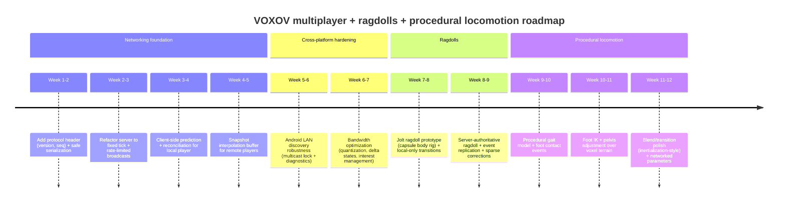

# VOXOV: Cross‑Platform Multiplayer, Ragdolls, and Procedural Locomotion — Repo Audit and Implementation Plan

> Archived note: this audit document is not the source of truth for the current repo shape. Prefer `README.md`, `docs/ARCHITECTURE.md`, `docs/NETWORKING.md`, `docs/ROADMAP.md`, and `docs/WEB.md` for the maintained runtime and platform documentation.

## Executive summary

The repository is a custom C++23 game codebase built via CMake, with desktop (Vulkan/OpenGL), Android, and an MVP Web (Emscripten/WebGL2) target. citeturn6view0turn18view0turn19view2 The networking stack currently uses ENet (reliable UDP with reliable/unreliable channels) for gameplay traffic plus a bespoke LAN discovery system using UDP broadcast sockets. citeturn19view0turn22view0turn23view0turn14view1turn45view0

The code and docs describe an “authoritative server model,” but the current implementation behaves closer to a prototype foundation: the server simulates a simplified “ground plane” character controller, while the client simulates voxel collisions locally; server snapshots are received but not applied to reconcile local prediction; and the dedicated headless server loop can unintentionally transmit at extremely high rates because `NetServer::pump()` broadcasts every iteration of the main loop. citeturn19view0turn23view0turn31view0turn15view0turn33view4

On the animation side, there is already (a) glTF skinned mesh playback (via cgltf) and (b) a simple procedural stick-figure skeleton used for debug visualization. The network currently replicates `anim_state`, `anim_phase`, and `anim_blend` for remote players, which is a strong foundation for networking “procedural locomotion parameters” instead of raw bone transforms. citeturn17view0turn16view0turn31view0turn23view0

Key near-term priorities are therefore:
- Fix server send-rate/tick scheduling and stop broadcasting on every `pump()` call, to eliminate jitter/bandwidth blowups and make behavior consistent across platforms and network conditions. citeturn23view0turn15view0turn33view4turn33view5  
- Introduce explicit protocol framing/versioning/sequence numbers and safer serialization (or at least explicit packing + endianness strategy), because the protocol currently memcpy’s packed structs without versioning. citeturn8view2turn22view0turn23view0turn19view0  
- Move toward true server authority for movement by running the same movement+collision logic server-side (or a compatible approximation) and adding client-side prediction + reconciliation. citeturn23view0turn25view1turn31view0turn47view0  
- For ragdolls, use the existing Jolt integration as the physics backend and network ragdoll state using event+low-rate corrections rather than high-rate full-bone replication. citeturn24view1turn33view2turn42view3turn33view5  
- For Web, do not assume UDP; plan for a transport “shim” (WebRTC/WebTransport/WebSocket proxy) because direct browser UDP is not available in the same way as native sockets. citeturn19view2turn33view3turn46view0

## Repository audit of multiplayer implementation

### Engine/framework signals

The build system shows a custom engine (not Unity/Unreal/Godot) with Vulkan as default desktop backend, optional OpenGL, and optional Android/Web builds. The project pulls in ENet and Jolt Physics, among other third-party dependencies. citeturn6view0 The README and docs position the project as cross-platform multiplayer co-op. citeturn18view0turn19view0

### Networking-related file map and responsibilities

| Path | Role in networking | Notes |
|---|---|---|
| `src/engine_net/net_common.hpp` | Protocol types + core replicated structs | Defines `NetMsgType`, channel enum, and structs like `NetTickInput`, `NetSnapshot`, `NetPlayerState`, `NetChunkInterest`, `NetChunkState`. citeturn8view2 |
| `src/engine_net/net_client.hpp/.cpp` | ENet client | Initializes ENet, connects, pumps events, sends input (unreliable) and chunk interest (reliable), stores latest snapshot and per-player states. citeturn22view0turn8view2 |
| `src/engine_net/net_server.hpp/.cpp` | ENet server | Initializes ENet host, assigns player IDs, processes input packets, sends per-client snapshot (unreliable), broadcasts `PlayerState` for all players (unreliable), responds to chunk interest (reliable). citeturn23view0turn8view2 |
| `src/engine_net/lan_discovery.hpp/.cpp` | LAN host discovery via UDP broadcast | Broadcast beacon/query packets; maintains host list with expiry; uses platform socket APIs. citeturn14view1 |
| `src/engine/engine.hpp/.cpp` | Main integration point | Owns `NetClient`, `LanDiscovery`, and optionally an in-process `NetServer`; sends inputs each fixed tick; smooths remote players; handles join/host menu actions. citeturn14view0turn20view0turn21view0turn31view0 |
| `src/game/main.cpp` | Desktop entry point | CLI flags for `--server` and `--headless-server`; runs `NetServer::pump()` directly; client can `--connect`. citeturn15view0 |
| `src/game/android_main.cpp` | Android entry point | Has an Android-side loop and also instantiates `NetClient`, `LanDiscovery`, `NetServer` for local hosting/joining. citeturn15view1 |
| `src/engine_ui/gui_menu.*` | Multiplayer UI actions | Menu triggers host local/LAN and join nearby. citeturn29view0turn29view1 |

### Entry points and runtime modes

Desktop supports:
- Combined client+server in one process via `--server`. citeturn18view2turn15view0turn23view0  
- Dedicated headless server via `--headless-server --port 7777`, implemented as a tight loop calling `server.pump()` with a ~1ms sleep. citeturn18view1turn15view0  
Clients can connect with `--connect <host> --port 7777`. citeturn19view0turn15view0

Within the engine main loop, networking is driven from the fixed-step simulation: each fixed tick calls `sync_network_state(fixed.tick, step_input)` to send inputs, pump the client, ingest remote states, and update smoothing targets. citeturn21view0turn31view0

LAN discovery is also integrated in the engine tick: hosts broadcast beacons, clients query and connect to discovered hosts. citeturn14view1turn21view0

### Message formats and transport layers

#### Transport layers

Gameplay data uses ENet: a UDP-based library that provides optional reliable, in-order delivery and packet fragmentation while intentionally omitting higher-level systems like authentication and matchmaking. citeturn45view0turn22view0turn23view0

LAN discovery uses raw UDP broadcast (`SO_BROADCAST`) on a fixed discovery port, with an internal packet struct containing a magic header (`"VOXOV2"`), packet type (beacon/query), game port, and host name. citeturn14view1  

On Android Wi‑Fi, multicast/broadcast reception can be filtered by the Wi‑Fi stack unless the app acquires a `WifiManager.MulticastLock`, which is a common reason LAN discovery works on desktop but not on some Android devices. citeturn37view0turn14view1

#### Protocol framing and message types

The protocol is “struct packets” with the first byte a `NetMsgType` and the remainder a memcpy’d C++ struct. citeturn22view0turn23view0turn8view2 The currently documented packet types in `docs/NETWORKING.md` match the code: Input, Snapshot, AssignPlayer, PlayerState, ChunkInterest, ChunkState. citeturn19view0turn22view0turn23view0

Key fields:
- `NetTickInput`: tick + movement axes + action flags. citeturn8view2turn22view0  
- `NetSnapshot`: server response for the local player, includes tick and position/velocity. citeturn8view2turn23view0  
- `NetPlayerState`: broadcast state for each player, includes position/velocity and animation parameters. citeturn8view2turn23view0turn31view0  

### Authoritative vs client-side logic

The docs state “authoritative server model over ENet,” with clients sending input ticks and server sending snapshots and states. citeturn19view0 That is structurally correct at the API boundary: clients send `NetTickInput`, server replies with `NetSnapshot` to the same peer and broadcasts `NetPlayerState` for all peers. citeturn22view0turn23view0

However, the actual simulation responsibilities are currently split in a way that will produce divergence:
- The client runs real voxel collision resolution (`VoxelCollisionWorld::resolve_capsule`, raycasts, spawn height search) via `PlayerControllerSystem::simulate_fixed`, and uses that as the ground truth for local movement. citeturn25view1turn31view0turn12view1  
- The server runs a simplified kinematic controller against a constant ground plane `kServerSpawnY` and does not reference voxel collisions or Jolt. citeturn23view0turn24view1turn25view1  
- The engine receives authoritative server snapshots (`net_client.poll_snapshot` sets `has_snapshot = true`), but the local player’s position is not reconciled against `latest_snapshot`; the snapshot is currently stored and not applied. citeturn22view0turn21view0  

For remote players, the engine applies a simple smoothing/extrapolation scheme: it lerps towards a velocity-extrapolated `target_position` and slerps orientation towards “facing from velocity.” citeturn21view0turn31view0 This is a reasonable placeholder, but it does not implement jitter buffering and “time-based interpolation” that is typically required to avoid hitches under real network jitter. citeturn33view4turn33view5

### Bugs and multiplayer anti-patterns observed

The following are the most consequential issues to fix first because they directly cause “multiplayer is jittery / broken / desyncs / melts bandwidth”:

- **Unbounded server broadcast rate in headless mode**: the headless server loop calls `server.pump()` continuously with a ~1ms sleep. citeturn15view0 `NetServer::pump()` calls `broadcast_player_states()` once per call, regardless of time and regardless of whether new data arrived. citeturn23view0 This can easily become hundreds to ~1000 broadcast iterations per second, which is exactly the kind of “LAN looks fine but Wi‑Fi/Internet hitches” failure mode described in snapshot networking literature. citeturn33view4turn33view5

- **Simulation tied to packet receive**: the server advances a player’s physics only when it receives an `Input` packet (and uses a fixed `kServerTickDt` per packet). citeturn23view0 This means lost packets implicitly pause simulation for that player and make simulation rate depend on network delivery patterns—an approach that can be made to work, but only if the protocol includes time/sequence handling robustly; the current protocol does not include a timebase beyond “tick,” and the server does not reject out-of-order tick values. citeturn23view0turn8view2turn47view0

- **No explicit protocol versioning / framing / validation**: packets are memcpy’d into structs with minimal checks (`dataLength >= sizeof(PacketType)` and `packet.type == ...`). citeturn22view0turn23view0 The docs explicitly note that protocol versioning is a planned improvement, and cross-platform builds (x86_64 + arm64) make this risk more important. citeturn19view0turn18view0

- **Potential chunk key collisions**: the server computes a chunk key as `(coord.x << 16) ^ coord.z`. citeturn23view0 XOR-based mixing can collide (different `(x,z)` pairs mapping to the same key), which will eventually cause “wrong chunk version cached” behavior as chunk replication becomes real.

- **Remote smoothing without jitter buffer**: the client uses a fast exponential approach to a predicted target without keeping a time-ordered snapshot buffer. citeturn21view0turn31view0 Under jitter, the recommended approach is to buffer snapshots and render “slightly in the past,” rather than chase last-received state directly. citeturn33view4turn33view5

## Cross-platform networking options and recommended stack

### Constraint analysis for this repo

Native targets (Windows/Linux/Android) can use UDP-based transports directly, which suits fast-moving player/physics updates. citeturn18view0turn22view0turn23view0 The web target is explicitly an MVP bootstrap and does not yet aim for gameplay/network parity; additionally, browser networking constraints mean you cannot simply “use ENet UDP” in the browser without a proxy/translation layer or a browser-native transport (WebRTC/WebTransport/WebSockets). citeturn19view2turn33view3turn46view0

### Comparison table of realistic options

| Option | What it gives you | Cross-platform fit | Web fit | Major pros | Major cons |
|---|---|---|---|---|---|
| ENet | “Reliable UDP” with reliable/unreliable channels; low-level, embeddable; omits auth/matchmaking | Good for native C/C++ targets citeturn45view0 | Not browser-native; needs proxy/bridge citeturn33view3turn46view0 | Already integrated in repo; matches current client/server design citeturn19view0turn22view0turn23view0 | You still must design protocol, versioning, snapshots, security, NAT traversal yourself citeturn45view0turn19view0 |
| Valve GameNetworkingSockets | Reliable+unreliable over UDP; fragmentation; P2P/NAT traversal; encryption | Good for native C++ | Still not browser-native | More “complete” transport features than ENet (NAT traversal/encryption) citeturn33view1 | Bigger dependency footprint; still requires higher-level game protocol design citeturn33view1turn47view0 |
| WebRTC DataChannels via libdatachannel | WebRTC DataChannels + ICE/DTLS/SCTP; explicitly targets native↔browser interoperability | Good for native; supports Android/iOS/desktop citeturn49view1 | Strong: designed for browser P2P data | Direct browser compatibility; can unify “native and web” under one API citeturn49view1turn46view0 | Operational complexity (signaling, STUN/TURN), and SCTP semantics differ from raw UDP for “unreliable” gameplay traffic citeturn49view1turn46view0 |
| QUIC libraries (MsQuic / quiche) | Modern encrypted transport with streams; QUIC ecosystem | Native feasible; MsQuic is cross-platform C citeturn49view0 | Browser access is indirect (WebTransport), not raw QUIC sockets | Strong security, multiplexing, modern congestion control; mature implementations exist citeturn49view0turn49view3 | Not “drop-in UDP”; you must map game’s unreliable datagrams appropriately; extra complexity for real-time action replication citeturn49view0turn33view5 |
| WebTransport | Browser API that can support datagrams (unreliable) in HTTP/3 mode | Server-side support required | First-class browser API; supports datagrams and reliability modes citeturn50view0turn50view1turn50view2 | “Web-native” route to UDP-like datagrams; good long-term web story | Still evolving; requires a WebTransport-capable server stack; toolchain complexity citeturn49view2turn50view2 |

### Recommended stack for this repo

**Recommendation for the next implementation phase**: keep ENet for native targets and introduce a small transport abstraction layer so you can later plug in a web transport (WebRTC or WebTransport) without rewriting the game protocol. This aligns with ENet’s design philosophy (thin layer over UDP; higher-level features are app-specific) and with the repo already using ENet today. citeturn45view0turn22view0turn23view0

For Web support, the most practical “do not fight the browser” paths are:
- **WebRTC DataChannels**, where libdatachannel explicitly targets interoperability between native apps and browsers and advertises support for multiple native platforms. citeturn49view1turn46view0  
- **WebTransport**, when you are ready to operate an HTTP/3/WebTransport-capable server and want browser datagrams with an explicit reliability mode ecosystem. citeturn50view0turn50view1turn50view2

If “web multiplayer” is not needed soon, you can also defer Web networking entirely and keep the current web target as a rendering/bootstrap experiment, consistent with `docs/WEB.md`. citeturn19view2

## Synchronization strategies for movement, physics, ragdolls, and animation

### First-principles model to converge on

For action games with player movement and jumping, the standard approach is server-authoritative simulation driven strictly by input, where clients send a stream of input commands and the server sends back authoritative state updates/snapshots. citeturn47view0turn19view0 Hiding latency for the local player typically requires client-side prediction plus reconciliation: the client simulates immediately, stores input history, and when authoritative state arrives for an earlier tick/time, it rewinds and replays inputs to correct. citeturn47view0 Remote entities (other players) are usually rendered with snapshot interpolation—buffering incoming states and rendering slightly in the past—to compensate for jitter. citeturn33view4turn33view5

This repo already has the right structural “hooks” (fixed-step loop, `tick` in input, snapshot structs), but it is missing the enforcing machinery: tick scheduling, sequence handling, and reconciliation. citeturn31view0turn8view2turn22view0turn23view0

### Movement: concrete client prediction + reconciliation plan

**Server target**: simulate at a fixed rate (e.g., 60 Hz) independent of packet arrival, consuming the “latest input for each player” each tick, and emitting authoritative snapshots at a controlled send rate (e.g., 20–30 Hz). This directly addresses the current unbounded broadcast in `NetServer::pump()`. citeturn23view0turn15view0turn33view4turn33view5

**Client target**: keep a ring buffer of `(tick, input, predicted_state)`; on server snapshot for `tick = T`, compare predicted state at `T` to authoritative state; if error exceeds threshold, rewind to `T` and replay inputs `T+1..now`. This is the canonical approach described in networked physics literature. citeturn47view0

A minimal reconciliation loop (pseudocode) that matches the repo’s current fixed tick architecture:

```cpp
// Called once per fixed tick on client
void ClientSimTick(uint32_t tick, InputState input) {
  NetTickInput netInput = EncodeInput(tick, input);
  SendInputUnreliable(netInput);

  // Predict immediately using local movement code.
  PredictedState s = SimulatePlayer(state, input, fixed_dt);
  history[tick % HISTORY] = { tick, netInput, s };
  state = s;

  // Apply authoritative correction if we received one.
  if (HasSnapshotForTick(snapshot.tick)) {
    uint32_t T = snapshot.tick;
    PredictedState predictedAtT = history[T % HISTORY].state;
    float posError = length(predictedAtT.pos - snapshot.pos);

    if (posError > kPosErrorThreshold) {
      state = snapshot.ToPredictedState();
      for (uint32_t t = T + 1; t <= tick; ++t) {
        state = SimulatePlayer(state, DecodeInput(history[t % HISTORY].input), fixed_dt);
        history[t % HISTORY].state = state; // re-cache corrected results
      }
    }
  }
}
```

This fits naturally into `Engine::tick`’s fixed-step loop where `sync_network_state(fixed.tick, step_input)` is already called once per fixed step. citeturn31view0 The server half requires moving from “process only on receive” to “process on tick,” which is essential for consistent gameplay and bandwidth. citeturn23view0turn33view5

### Remote players: from exponential smoothing to snapshot interpolation

The repo currently extrapolates remote targets by `velocity * 0.035` and lerps quickly. citeturn31view0 This will still hitch under jitter because packets do not arrive evenly spaced even if you send at 60 pps; buffering is the standard answer. citeturn33view4

Concrete replacement:
- Maintain a per-remote-player deque of `(serverTimeOrTick, state)` sorted by arrival time (discard out-of-order using a sequence number). citeturn33view4  
- Render at `render_time = now - interpolation_delay` (e.g., 100–150 ms depending on target send rate and jitter tolerance). citeturn33view5  
- Find the two snapshots surrounding `render_time` and interpolate position/orientation; if behind, clamp; if ahead, optionally limited extrapolation.

This requires adding:
- A **per-snapshot sequence number** so older snapshots can be discarded reliably. citeturn33view4  
- A controlled server send rate so the buffer spacing is predictable. citeturn33view5turn23view0  

### Bandwidth and packet design implications

The snapshot compression literature highlights a simple reality: increasing send rate reduces interpolation delay but quickly explodes bandwidth unless the payload is aggressively optimized and quantized. citeturn33view5 The current headless server behavior (effectively “send as fast as loop runs”) is far beyond even 60 Hz and therefore guarantees bandwidth waste and jitter-related hitches on real networks. citeturn15view0turn23view0turn33view4

A practical target for this game’s current scope (few players, co-op) is:
- Client → server input: 60 Hz unreliable, ~10–20 bytes payload after packing. citeturn8view2turn47view0  
- Server → client snapshots for owned player: 20–30 Hz unreliable, ~20–40 bytes after quantization. citeturn33view5turn8view2  
- Server → all clients player states: 20 Hz unreliable, delta/quantized. citeturn33view5turn23view0  
- Chunk replication: reliable, event-driven (not per tick). citeturn23view0turn8view2  

### Ragdolls: synchronization strategy that respects cross-platform physics reality

Ragdolls are physics-driven and generally not bit-deterministic across platforms/architectures, so you should avoid “pure input-sync determinism” for ragdolls unless you tightly control the physics stack and accept occasional divergence. citeturn33view5turn24view1

Given the repo already includes Jolt, a practical plan is:
- Make ragdolls **server authoritative** (server simulates ragdoll bodies and constraints). citeturn33view2turn42view3  
- Network ragdolls using an **event + sparse correction** approach:
  - Event: “enter ragdoll” with root pose, linear/angular velocities, and optional impulse. citeturn42view3  
  - Sparse corrections: at ~10–15 Hz, send root transform + a small subset of key body transforms (hips/chest/head/hands/feet) and let clients blend/correct. citeturn33view5turn42view3  

Jolt exposes APIs to get and set ragdoll pose and to drive a ragdoll toward a target pose using kinematics or motors, which is exactly what you need for “ragdoll recovery” and for network correction blending. citeturn42view3turn33view2

### Animation: network parameters, not bones

The repo already replicates `anim_state`, `anim_phase`, and `anim_blend` per remote player (server computes these values and broadcasts them). citeturn23view0turn31view0 This is a best-practice direction for procedural locomotion: instead of sending 15–60 bone transforms per tick, replicate a compact, deterministic “locomotion parameter set” (gait, phase, blend weights, foot contact flags) and let each client synthesize the pose locally. citeturn33view5turn16view0

## Debugging playbook for cross-platform multiplayer

### Reproduction checklist tied to this repo’s modes

Start from the repo’s documented commands so debugging is reproducible and comparable across platforms:
- Dedicated server: run headless server on a fixed port. citeturn18view1turn19view0turn15view0  
- Two clients: connect from two machines (or one machine + Android). citeturn19view0turn18view0turn15view1  
- Enable `--devhud` to surface local tick dt, collision flags, and remote count (`REM`) plus network connected status. citeturn19view0turn31view0turn19view1  

### High-signal debugging steps for the current bug profile

**Server send-rate sanity**
1. Add counters in `NetServer` for packets-per-second and bytes-per-second, and print once per second. This is critical because the current headless loop can unintentionally run near 1000 Hz. citeturn15view0turn23view0  
2. Confirm server uses an explicit simulation tick (60 Hz) and a distinct “state broadcast tick” (e.g., 20 Hz). Any `broadcast_player_states()` call path should be behind that timer, not unconditional. citeturn23view0turn33view5  

**Client snapshot correctness**
1. Instrument snapshot receipt: log `(seq, tick, pos, vel)` for each snapshot and confirm tick monotonicity per connection using a sequence number rule similar to snapshot interpolation guidance. citeturn33view4turn22view0  
2. Implement a “snap-to-authority” debug toggle before full reconciliation: if enabled, overwrite local player state with snapshot each time and measure error. This provides a baseline to validate server movement logic before adding reconciliation complexity. citeturn23view0turn31view0  

**Remote jitter characterization**
1. Log inter-arrival times for `PlayerState` updates and correlate with visual hitching; jitter is expected on Wi‑Fi/Internet even if LAN seems smooth. citeturn33view4turn33view5  
2. Switch from exponential smoothing to snapshot interpolation buffer and validate hitch reduction under induced jitter. citeturn33view4turn33view5  

**LAN discovery on Android**
1. If “Join Nearby” works on desktop but not Android, validate multicast/broadcast reception: on many devices you need `WifiManager.MulticastLock` to receive multicast/broadcast packets consistently. citeturn37view0turn14view1  
2. Ensure Android manifest includes multicast permission; AOSP defines `android.permission.CHANGE_WIFI_MULTICAST_STATE` as a normal permission enabling Wi‑Fi multicast mode. citeturn41view0turn37view0  

**Web target expectations**
Treat Web builds as “no UDP assumptions.” Emscripten networking often relies on WebSockets emulation or a proxy server and can’t just speak to a native UDP server without translation. citeturn33view3turn46view0turn19view2

## Ragdolls and procedural locomotion design for skeleton-only characters

### Current animation architecture in the repo

There are two animation pathways:
- **SkinnedModel glTF playback**: loads a glTF mesh+skin+animations via cgltf and can select different animation clips by string matching (run/walk/survey). citeturn17view1turn17view0turn31view0  
- **Procedural skeleton (debug)**: `SkeletalAnimator::sample_pose` builds a simple joint-position pose for walk/run/jump/crawl using sin/cos offsets and renders it as debug bones. citeturn16view0turn31view0  

Remote animation is networked as `(anim_state, anim_phase, anim_blend)` and used both for capsule bobbing and for selecting/advancing the rendered skinned mesh pose. citeturn23view0turn31view0

This means your “skeleton-only locomotion” work can start immediately by expanding the procedural skeleton path (because it requires no authored animation data) and only later unify it with skinned mesh rendering.

image_group{"layout":"carousel","aspect_ratio":"16:9","query":["ragdoll physics skeleton constraint diagram","procedural foot placement inverse kinematics diagram","two bone IK leg target hint diagram","character locomotion state machine diagram"],"num_per_query":1}

### Procedural walk cycle generation

A robust yet lightweight procedural walk cycle can be driven from three parameters:
- `speed` (planar magnitude)
- `gait_cycle_rate` (step frequency, usually proportional to speed)
- `phase` (0..2π), advanced each sim tick  

The repo already does this conceptually: server and client both treat `anim_phase` as a continuously advancing cycle and blend it toward a target. citeturn23view0turn31view0

To improve from “sinusoidal limbs” to production-grade procedural locomotion without mocap:
- Split the cycle into **stance** and **swing** phases with explicit **foot contact events** (left_contact/right_contact bits). This improves foot locking and network determinism.
- Drive pelvis vertical/horizontal offsets as a smoothed function of stance/swing (reduces “floating torso” look).
- Add controlled arm swing from opposite leg phase (already approximated). citeturn16view0  

### IK/FK and foot placement

For uneven voxel terrain, foot placement is mostly: (1) find where the foot *should* be on the ground, (2) solve the leg chain so the foot reaches that target, and (3) adjust pelvis if the target is out of reach.

Implementation plan using repo primitives:
- Use `VoxelCollisionWorld::raycast` down from each predicted foot position to find a ground hit location. citeturn25view0turn25view1  
- Solve hip–knee–ankle with a two-bone IK solver (analytic or iterative). Unity’s Two Bone IK constraint description captures the conceptual structure: root/mid/tip aiming the tip at a target with a hint for bend direction. citeturn42view1  
- For more complex chains or if you later add toes/spine/head look-at, FABRIK is a well-known fast iterative solver that works by repositioning joint points rather than computing angles directly. citeturn42view0  

A minimal two-bone IK pseudocode (analytic) for 3D can be structured as: project to a plane defined by the bend hint, solve triangle angles via law of cosines, then reconstruct joint rotations in 3D (the exact math depends on your bone representation). Conceptually, this matches the “root/mid/tip” hierarchy described in Two Bone IK docs. citeturn42view1

### State machines and blending

You already have an enum of locomotion states (`Idle/Walk/Run/Jump/Crawl`). citeturn30view0turn23view0 Extend this to include:
- `Fall` (separate from Jump for long airtime)
- `Land` (short transient)
- `Ragdoll`
- `GetUp` (recover from ragdoll)

Blending requirements:
- Blend locomotion layers (lower body) with aim/look layers (upper body) using per-bone blend masks (conceptually similar to “blend per bone” nodes in engine animation graphs). citeturn44view1  
- For rapid transitions, consider inertialization-style post-process blending (stop evaluating the outgoing pose and instead decay offsets), which is documented as a high-performance alternative to traditional crossfades. citeturn44view0turn44view1  

### Ragdolls using Jolt

The repo already initializes Jolt with a physics system and job system. citeturn24view1 Jolt provides explicit ragdoll structures (`RagdollSettings` describes the ragdoll skeleton and constraints) and runtime APIs (`Ragdoll`) to get/set pose, add impulses, and drive a ragdoll toward a pose. citeturn33view2turn42view3

A practical implementation sequence:

1. **Author ragdoll “physics rig”**: define bodies for pelvis/spine/head/upper/lower arms/upper/lower legs with simple capsules or boxes, with constraints matching human joints. Use `RagdollSettings` as the container. citeturn33view2turn42view3  
2. **Enter ragdoll**: at the moment of death/knockback, set ragdoll pose from current animated skeleton pose and apply an impulse/velocity. citeturn42view3  
3. **Simulate**: ragdoll bodies update in physics; optionally clamp extreme joint angles. citeturn33view2turn42view3  
4. **Recover (get-up)**: sample ragdoll pose, decide “face-up/face-down,” blend to a get-up animation, and optionally use Jolt’s drive-to-pose helpers to pull physics toward an animated pose over time (`DriveToPoseUsingKinematics` or motors). citeturn42view3turn44view0  

### Networking ragdolls efficiently

Use a two-tier replication model:
- Tier A (events, reliable): `EnterRagdoll`, `ExitRagdoll`, `ApplyImpulse`, with timestamps/ticks.  
- Tier B (state, unreliable): low-rate corrections (root pose + a few bodies), and client-side smoothing to hide updates.

This fits the same “inputs are frequent; state is periodic; reliable only for events” principle used in networked physics. citeturn47view0turn33view5

### API-level integration points in this repo

Below are the highest-leverage touchpoints based on current structure:

- **Network protocol**: extend `NetMsgType` and add versioning/sequence fields in `net_common.hpp`; update packet wrapper structs in `net_client.cpp` and `net_server.cpp`. citeturn8view2turn22view0turn23view0  
- **Simulation tick ownership**: refactor `NetServer::pump()` into “service network events” + “advance simulation on fixed tick” so headless mode doesn’t melt bandwidth. citeturn23view0turn15view0  
- **Client prediction**: integrate reconciliation at `Engine::sync_network_state` / the fixed-step loop where input is already sent each tick. citeturn31view0turn21view0  
- **Procedural locomotion**: expand `PlayerControllerSystem::update_animation_state` and/or evolve `SkeletalAnimator` from “joint positions” to a true pose structure (joint rotations + optional foot contact), then render via debug rig first. citeturn12view1turn16view0turn31view0  
- **Skinned avatar override**: extend `SkinnedModel::build_render_mesh` to accept an externally supplied pose (joint matrices) so ragdoll/procedural skeleton can drive the mesh instead of baked clip sampling. citeturn17view1turn42view3  
- **LAN discovery stability on Android**: in the Android platform glue, add `WifiManager.MulticastLock` acquisition around discovery to mitigate Wi‑Fi filtering behavior. citeturn37view0turn14view1turn41view0  

## Testing, profiling, and migration notes

### Automated testing plan

The repo already supports building tests with `-DVOXOV_BUILD_TESTS=ON` and running them via CTest. citeturn18view1turn18view2 Extend this with three layers:

**Protocol unit tests**
- Serialize/deserialize each message type with fuzzed sizes and ensure invalid lengths are rejected (prevents memcpy-from-wire hazards). citeturn22view0turn23view0turn19view0  
- Round-trip quantization tests for packed position/velocity formats (critical if you follow bandwidth reduction guidance). citeturn33view5turn47view0  

**Deterministic movement tests**
- Run `PlayerControllerSystem::simulate_fixed` for N ticks on a fixed voxel scene and assert invariant bounds (no NaNs; capsule never penetrates more than skin width; grounded logic consistent). citeturn25view1turn12view1  

**Multiplayer integration tests**
- Spawn a headless server and two simulated clients in-process (or as subprocesses) with synthetic inputs; assert that after X seconds the server and client states converge within thresholds (post-reconciliation). citeturn15view0turn23view0turn47view0  

### Performance profiling guidance

The engine already computes FPS and an average CPU ms metric and displays network status and remote count in the dev HUD. citeturn31view0turn29view2 Treat this as your first “always-on” profiler and add:
- Network pps/bytes to the HUD to catch regressions like accidental “broadcast every loop.” citeturn23view0turn15view0  
- A physics cost breakdown once ragdolls are active (ragdolls increase body/constraint counts quickly). citeturn42view3turn24view1  

### Cross-platform migration pitfalls to plan for

**Android LAN discovery**
- Expect that Wi‑Fi multicast/broadcast reception may be filtered unless a multicast lock is held, and ensure you release it to avoid battery drain; the Android API explicitly notes multicast filtering behavior and battery impact. citeturn37view0turn14view1  
- Ensure manifest permissions include multicast mode; AOSP defines the permission entry for Wi‑Fi multicast mode. citeturn41view0  

**Web builds**
- Emscripten’s networking docs describe WebSocket emulation and a POSIX socket proxy server; direct UDP-like communication to a native UDP server generally requires a middle layer, and WebRTC/WebTransport are the more natural browser-side approaches. citeturn33view3turn46view0turn50view2  

**Transport evolution**
- If you later adopt a QUIC/WebTransport path, design your protocol to support unreliable datagrams and explicit reliability modes (WebTransport defines datagram concepts and reliability modes). citeturn50view0turn50view1turn50view2  
- If you adopt WebRTC via libdatachannel, plan for signaling and NAT traversal (ICE) as first-class operational requirements. citeturn49view1turn33view1  

### Roadmap timeline

The roadmap below is organized as “fix correctness first, then add features,” because ragdolls and advanced procedural animation will be much harder to debug until the networking tick/snapshot foundation is stable. citeturn23view0turn33view4turn33view5turn42view3


